# Pi Agent Harness 系统设计文档

> 文档定位：基于 `D:\02-Dev\pi` 既有源码与仓内文档进行**现状还原**（as-is），不提出改进建议。
>
> 系统名：Pi Agent Harness（npm 命名空间 `@earendil-works/*`）

---

## 全局绘图规范

- 统一使用 Mermaid 内嵌图源，保证可维护、可 diff；
- **7±2 原则**：单图节点 / 参与者 / 泳道控制在 5~9 个，超限先用 subgraph 分组，仍超限则拆成"主图 + 子图"；
- 表示系统整体对外依赖时，不从 subgraph 整框直接引边，改用框内**透明锚点节点**归并出线，并在图下配一句图例说明；
- 类图按 Sketch 模式使用 UML：成员行采用`名称 + 一句语义`速写体，不写类型签名与可见性；**方法行必须含 `()`**，否则 Mermaid 会与属性混排；职责注释行避免半角括号；
- getter/setter、纯透传字段、已由关联箭头表达的依赖不在类图中重复列出；
- 接口实现类超过 3 个时，主图只画接口，实现清单用表格附在图后。

---

# 1 需求背景与目标

## 1.1 背景与问题

当前市场上的 coding agent 普遍把**工作流、UI、权限模型、provider 生态**绑定在单一闭包内，带来三类典型问题：

- **可扩展性受限**：主流 agent 把 sub-agent、plan mode、审批流等做进核心，用户要么全盘接受，要么只能 fork 源码修改；团队或个人的定制需求（企业内网鉴权、私有模型、私有工具链）难以在不破坏升级路径的前提下接入；
- **provider 与凭证碎片化**：不同 LLM 厂商的 API 形态（OpenAI Responses/Completions、Anthropic Messages、Google Generative AI、Amazon Bedrock Converse 等）、流式事件、tool calling、thinking 内容、认证方式差异巨大，应用层需要重复编写适配与鉴权代码；
- **终端交互与集成方式单一**：很多 agent 只提供 Web UI 或只提供 CLI，难以嵌入编辑器、CI/CD、评测流水线或企业自有工作流；同时终端 UI 在长时间流式输出、图片渲染、IME、差分刷新等场景体验不佳；
- **权限边界含糊**：进程内"半吊子"沙盒容易被用户误读为安全边界，真实隔离反而不足。

Pi 项目的核心假设是：**coding agent 应该像终端里的 harness 一样——核心极小、可组合、可嵌入、provider 无关，并把安全边界明确交给宿主编排**。

## 1.2 方案目标：范围内 / 范围外

| 范围内（本系统做） | 范围外（本系统不做，由谁负责） |
|---|---|
| 多提供商 LLM 统一抽象（`pi-ai`）：模型目录、认证解析、流式/完整调用、tool schema、thinking 与 usage 统一 | LLM 模型训练、推理服务托管（由云厂商/本地 llama.cpp 等负责） |
| Agent 运行时（`pi-agent-core`）：多轮 tool-use loop、事件流、状态归约、取消/中断传播、工具执行模式 | 业务领域的任务规划算法（sub-agent/plan mode 由扩展或用户 prompt 负责） |
| 交互式 CLI（`pi-coding-agent`）：TUI、print/JSON/RPC 四种模式、内置工具、扩展体系、会话持久化与压缩 | 完整权限沙盒/容器化本身；仅提供文档与扩展点，真实隔离由外部容器/VM 负责 |
| 终端 UI 库（`pi-tui`）：差分渲染、CSI 2026 同步输出、组件、Overlay、IME、图片协议 | 非终端场景（Web GUI、移动 App）的 UI 渲染 |
| SQLite 存储后端（`pi-storage-sqlite-node`）：Node `node:sqlite` 适配与会话库表 | 其他后端存储（如云端会话数据库）由扩展或宿主实现 |
| Headless 多实例守护进程（`pi-server`）：本地 socket IPC、进程监管、Radius  presence | 多用户 SaaS 服务、远程网络监听面 |
| 行为评测包（`pi-evals`）：端到端用例与断言 | 通用 LLM benchmark 基础设施 |

**关键边界声明**：Pi 刻意保持"小核心 + 大扩展"，不内置 MCP、sub-agent、plan mode、审批弹窗、后台 shell、内置 TODO；这些全部通过 extensions/skills/packages 由第三方或用户自行实现。

---

# 2 系统总体设计

## 2.1 系统上下文与架构总览

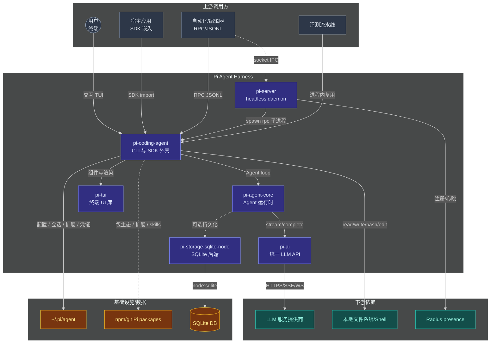
```mermaid
%%{init: {'theme':'dark', 'themeVariables': {'fontSize':'14px'}}}%%
flowchart TB
%% 上游调用方（聚合为子图，避免主图节点过多）
subgraph Upstream["上游调用方"]
    direction LR
    User(("用户<br/>终端"))
    HostApp["宿主应用<br/>SDK 嵌入"]
    Automation["自动化/编辑器<br/>RPC/JSONL"]
    EvalHarness["评测流水线"]
end

%% Pi Agent Harness 系统边界
subgraph Pi["Pi Agent Harness"]
    direction TB
    CodingAgent["pi-coding-agent<br/>CLI 与 SDK 外壳"]
    Server["pi-server<br/>headless daemon"]
    AgentCore["pi-agent-core<br/>Agent 运行时"]
    AI["pi-ai<br/>统一 LLM API"]
    TUI["pi-tui<br/>终端 UI 库"]
    Storage["pi-storage-sqlite-node<br/>SQLite 后端"]
end

%% 下游依赖
subgraph Downstream["下游依赖"]
    direction LR
    LLMProviders["LLM 服务提供商"]
    FileShell["本地文件系统/Shell"]
    Radius["Radius presence"]
end

%% 基础设施
subgraph Infra["基础设施/数据"]
    direction LR
    PiConfig["~/.pi/agent"]
    PiPackages["npm/git Pi packages"]
    SQLiteDB[("SQLite DB")]
end

%% 调用关系
User -->|"交互 TUI"| CodingAgent
HostApp -->|"SDK import"| CodingAgent
Automation -->|"RPC JSONL"| CodingAgent
Automation -.->|"socket IPC"| Server
Server -->|"spawn rpc 子进程"| CodingAgent
EvalHarness -->|"进程内复用"| CodingAgent

CodingAgent -->|"组件与渲染"| TUI
CodingAgent -->|"Agent loop"| AgentCore
AgentCore -->|"stream/complete"| AI
AI -->|"HTTPS/SSE/WS"| LLMProviders

CodingAgent -->|"read/write/bash/edit"| FileShell
AgentCore -.->|"可选持久化"| Storage
Storage -->|"node:sqlite"| SQLiteDB
Server -->|"注册/心跳"| Radius

%% pi-coding-agent 直接读写配置、会话、扩展、凭证与 Pi packages 生态
CodingAgent -->|"配置 / 会话 / 扩展 / 凭证"| PiConfig
CodingAgent -.->|"包生态 / 扩展 / skills"| PiPackages

classDef external fill:#2d3748,stroke:#94a3b8,color:#e2e8f0
classDef system fill:#312e81,stroke:#818cf8,color:#e0e7ff
classDef downstream fill:#134e4a,stroke:#2dd4bf,color:#99f6e4
classDef infra fill:#78350f,stroke:#fbbf24,color:#fde68a

class User,HostApp,Automation,EvalHarness external
class CodingAgent,Server,AgentCore,AI,TUI,Storage system
class LLMProviders,FileShell,Radius downstream
class PiConfig,PiPackages,SQLiteDB infra
```

> 图例：配置、会话、扩展、凭证与 Pi packages 生态均由可见模块 `pi-coding-agent`（CLI/SDK）直接读写；箭头从 `pi-coding-agent` 指向 `~/.pi/agent` 与 `npm/git Pi packages`，表示这些基础设施是 `pi-coding-agent` 的运行时依赖与输出目标，而非从隐身锚点引出的抽象依赖。

| 包/模块 | 定位 | 核心职责 |
|---|---|---|
| **pi-ai** | 模型层 | 统一多提供商 LLM API：provider 注册、模型目录、认证解析、流式与完整调用、tool schema、thinking/usage 归一 |
| **pi-agent-core** | 运行时层 | 有状态 Agent loop：LLM 调用 → tool call 解析 → 工具执行 → 结果回填 → 再调 LLM；事件流、状态归约、取消传播 |
| **pi-coding-agent** | 应用/编排层 | 交互式 coding harness：四种运行模式、内置工具、扩展体系、会话树/压缩、TUI 组装、信任与配置管理 |
| **pi-tui** | 终端 UI 层 | 差分渲染终端 UI 库：组件、Overlay、IME、Kitty/iTerm2 图像、CSI 2026 同步输出 |
| **pi-storage-sqlite-node** | 持久化层 | Node `node:sqlite` 适配 + `SqliteSessionRepo`/`SqliteSessionStorage`，供 `pi-agent-core` 会话可选落盘 |
| **pi-server** | 守护进程层 | 实验性 headless 多实例守护：本地 socket IPC、监管 `pi --mode rpc` 子进程、Radius presence |
| **pi-evals** | 评测层 | 端到端行为评测：进程内复用 coding-agent 服务装配，隔离临时目录运行 vitest 断言 |

## 2.2 对外提供的接口

Pi 作为 coding agent harness，对外暴露四类集成面：**CLI 命令**、**SDK 导出**、**RPC 协议**、**包管理器命令**。统一说明：CLI 以进程退出码标识结果；SDK 通过 `Promise` reject / 事件流 `error` 事件暴露错误；RPC 以 JSONL 的 `ok: false` 响应承载错误。

| # | 集成面 | 形态 | 用途 |
|---|---|---|---|
| 1 | CLI `pi` | 子进程 | 交互 TUI / print / JSON / RPC / 包管理 等全部入口 |
| 2 | SDK `@earendil-works/pi-coding-agent` | ES 模块 import | 嵌入 Node.js 应用：创建 `AgentSession`、工具工厂、扩展类型 |
| 3 | RPC 协议 | stdio 或 socket JSONL | 外部编辑器 / 脚本 / `pi-server` 与 Pi 子进程通信 |
| 4 | `pi install/remove/update/list/config` | CLI 子命令 | 管理 extensions/skills/prompts/themes/models 的 npm/git 包 |

### 接口① CLI `pi`

`pi [options] [@files...] [messages...]`——一句话契约：启动一次 Pi 会话，默认进入交互 TUI；通过选项切换为 print/JSON/RPC 模式或执行包管理。

**主要选项参数**（节选，按功能分组）

| 字段 | 类型 | 必填 | 默认值 | 说明 |
|---|---|---|---|---|
| mode | enum | 否 | interactive | `interactive` / `print` / `json` / `rpc` |
| provider | string | 否 | settings 或首个可用 | LLM provider ID |
| model | string | 否 | settings 或首个可用 | 模型 pattern，支持 `provider/id` 与 `:thinking` 后缀 |
| api-key | string | 否 | auth.json / env | 显式 API key |
| thinking | enum | 否 | settings | `off` / `minimal` / `low` / `medium` / `high` / `xhigh` / `max` |
| print (`-p`) | boolean | 否 | false | 非交互模式：单 prompt 输出后退出 |
| continue (`-c`) | boolean | 否 | false | 继续最近会话 |
| resume (`-r`) | boolean | 否 | false | 弹出会话选择器 |
| session | string | 否 | — | 指定会话路径或 id |
| tools (`-t`) | string[] | 否 | — | 工具白名单 |
| exclude-tools (`-xt`) | string[] | 否 | — | 工具黑名单 |
| no-builtin-tools | boolean | 否 | false | 禁用全部内置工具 |
| extension (`-e`) | string[] | 否 | — | 显式加载扩展（path/npm/git） |
| skill | string[] | 否 | — | 显式加载 skill |
| prompt-template | string[] | 否 | — | 显式加载 prompt 模板 |
| theme | string[] | 否 | — | 显式加载主题 |
| offline | boolean | 否 | false | 关闭网络请求（模型目录刷新等） |
| verbose | boolean | 否 | false | 输出调试信息 |

### 接口② SDK 导出

`import { ... } from "@earendil-works/pi-coding-agent"`——嵌入 Node.js 应用，核心导出如下表。完整类型与工厂见 3.5 节详设。

| 分组 | 关键导出 | 用途 |
|---|---|---|
| 会话工厂 | `createAgentSession`、`createAgentSessionRuntime`、`createAgentSessionServices`、`createAgentSessionFromServices` | 按 cwd 装配会话运行时 |
| 会话对象 | `AgentSession` | prompt/steer/followUp/compact/abort/subscribe |
| 模型 | `ModelRuntime`、`ModelRegistry`、`resolveCliModel` | provider/model 解析与凭证 |
| 工具 | `createCodingTools`、`createReadOnlyTools`、`createBashTool`/`ReadTool`/`EditTool`/`WriteTool`/`GrepTool`/`FindTool`/`LsTool` | 内置工具工厂 |
| 扩展 | `ExtensionAPI`、`ExtensionFactory`、`InlineExtension` | 扩展类型 |
| 运行模式 | `InteractiveMode`、`runPrintMode`、`runRpcMode`、`RpcClient` | 模式入口 |

### 接口③ RPC 协议

`pi --mode rpc` 在 stdio 上提供**严格 LF 分隔的 JSONL** 协议；`pi-server` 通过本地 socket 把该协议桥接到多个客户端。请求可带 `id`，响应返回 `type: "response"`；异步事件流按 `AgentSessionEvent` 形态推送。

| 命令分组 | 代表命令 | 说明 |
|---|---|---|
| Prompting | `prompt`、`steer`、`follow_up`、`abort` | 会话输入与取消 |
| State | `get_state`、`get_messages` | 会话状态读取 |
| Model | `set_model`、`cycle_model`、`get_available_models` | 模型切换与查询 |
| Compaction | `compact`、`set_auto_compaction` | 上下文压缩 |
| Session | `switch_session`、`fork`、`clone`、`set_session_name` | 会话树导航 |
| Extension UI | `extension_ui_response` | 代理扩展 UI 请求 |

**错误响应示例形态**（无统一数字错误码）：

| 错误形态 | 适用接口 | 触发场景 |
|---|---|---|
| 进程非 0 退出码 | CLI | 参数错误、未处理的运行时异常 |
| `Promise.reject(Error)` | SDK | 配置缺失、会话不存在、provider 调用失败 |
| `{ type: "response", ok: false, error: "..." }` | RPC | 命令参数非法、会话状态不允许、provider 错误 |
| `AgentSessionEvent` 中 `type: "error"` | 流式事件 | LLM 请求失败、网络错误、用户取消 |

## 2.3 核心业务场景时序

下面展示**用户在交互 TUI 中输入一个 prompt，Agent 调用 bash 工具并返回结果**的端到端主流程。各模块内部细节在第 3 章展开。

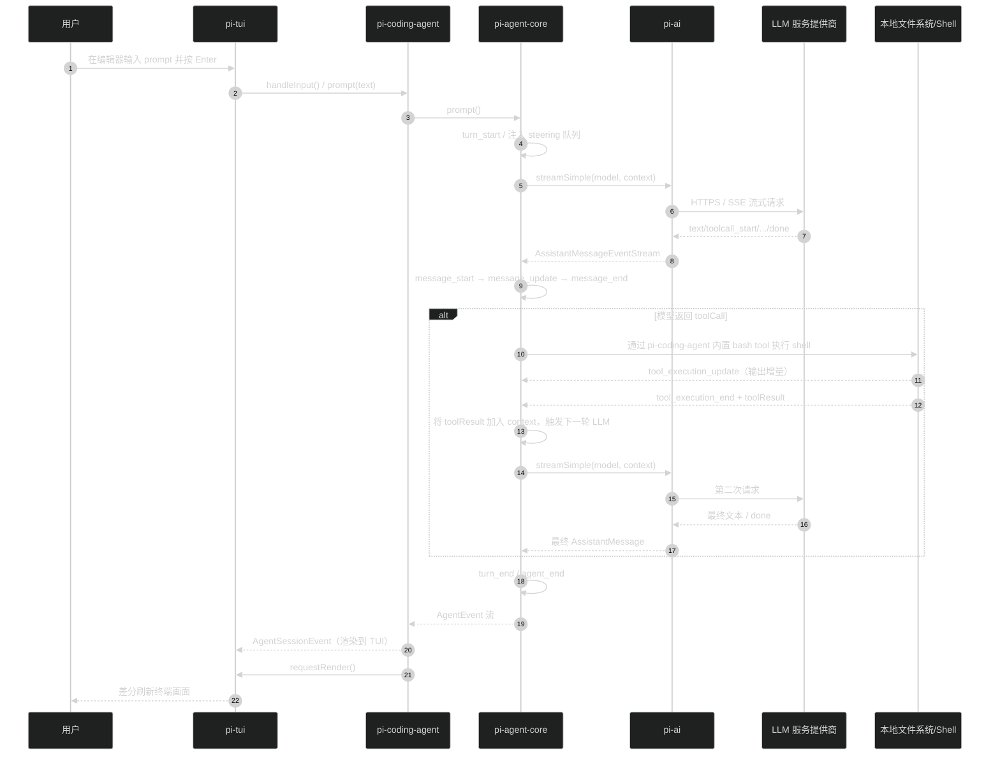
```mermaid
%%{init: {'theme':'dark', 'themeVariables': {'fontSize':'14px'}}}%%
sequenceDiagram
autonumber
participant User as 用户
participant TUI as pi-tui
participant CodingAgent as pi-coding-agent
participant AgentCore as pi-agent-core
participant AI as pi-ai
participant Provider as LLM 服务提供商
participant Shell as 本地文件系统/Shell

User->>TUI: 在编辑器输入 prompt 并按 Enter
TUI->>CodingAgent: handleInput() / prompt(text)
CodingAgent->>AgentCore: prompt()
AgentCore->>AgentCore: turn_start / 注入 steering 队列
AgentCore->>AI: streamSimple(model, context)
AI->>Provider: HTTPS / SSE 流式请求
Provider-->>AI: text/toolcall_start/.../done
AI-->>AgentCore: AssistantMessageEventStream
AgentCore->>AgentCore: message_start → message_update → message_end

alt 模型返回 toolCall
  AgentCore->>Shell: 通过 pi-coding-agent 内置 bash tool 执行 shell
  Shell-->>AgentCore: tool_execution_update（输出增量）
  Shell-->>AgentCore: tool_execution_end + toolResult
  AgentCore->>AgentCore: 将 toolResult 加入 context，触发下一轮 LLM
  AgentCore->>AI: streamSimple(model, context)
  AI->>Provider: 第二次请求
  Provider-->>AI: 最终文本 / done
  AI-->>AgentCore: 最终 AssistantMessage
end

AgentCore->>AgentCore: turn_end / agent_end
AgentCore-->>CodingAgent: AgentEvent 流
CodingAgent-->>TUI: AgentSessionEvent（渲染到 TUI）
CodingAgent->>TUI: requestRender()
TUI-->>User: 差分刷新终端画面
```

---

# 3 服务/模块详设

## 3.1 pi-ai（`@earendil-works/pi-ai`）

一句话定位：**统一多提供商 LLM API**，把 OpenAI/Anthropic/Google/Bedrock 等 30+ provider 的流式事件、tool calling、thinking、认证差异收敛成一致的 `Models` 集合与 `Context`/`Message` 模型。

### 3.1.1 对外提供的接口

| 导出/接口 | 形态 | 契约（一句话） | 调用方 |
|---|---|---|---|
| `createModels()` / `builtinModels()` | 工厂函数 | 创建空的或带全部内置 provider 的 `Models` 集合 | agent-core、coding-agent、server/evals |
| `Models.getProviders()` / `getModels()` / `getModel()` | 同步查询 | 按 provider id / model id 读取最后已知的模型目录 | CLI 列表、模型选择器 |
| `Models.refresh()` | async | 并发刷新所有支持动态列表的 provider | 启动、模型列表刷新 |
| `Models.getAuth()` / `checkAuth()` | async | 解析并校验 provider 认证（含 OAuth token refresh） | 状态栏、调用前预检 |
| `Models.stream()` / `complete()` | async | provider-aware 的流式/完整调用，自动应用 auth 与 headers | agent-core、compat 层 |
| `Models.streamSimple()` / `completeSimple()` | async | 用统一 `reasoning` 语义调用，无需关心 provider 特有选项 | coding-agent 默认路径 |
| `Provider` 接口 | interface | provider 运行单元：id、名称、auth、模型目录、`stream`/`streamSimple` | 自定义 provider 扩展 |
| `Tool<TParameters>` / `Context` / `Message` | 类型 | tool schema（TypeBox）、对话上下文、统一消息模型 | 所有上层 |
| `AssistantMessageEventStream` | class | 通用事件流：push/yield/result | stream 消费者 |
| `@.../pi-ai/providers/*` | 子路径 | 单 provider 工厂与静态目录 | 关注 bundle 大小的宿主 |
| `@.../pi-ai/compat` | 子路径 | 旧全局 API（stream/complete/env-api-key）兼容入口 | 旧版调用方 |

### 3.1.2 内部结构

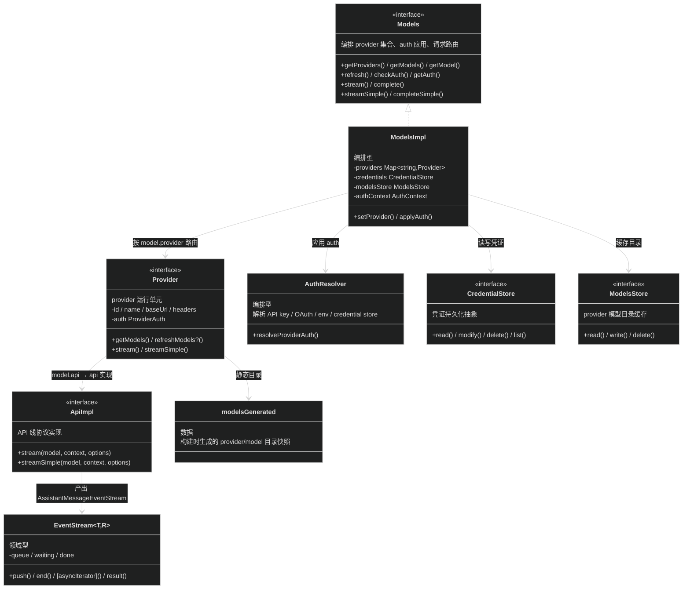
```mermaid
%%{init: {'theme':'dark', 'themeVariables': {'fontSize':'14px'}}}%%
classDiagram
    class Models {
        <<interface>>
        编排 provider 集合、auth 应用、请求路由
        +getProviders() / getModels() / getModel()
        +refresh() / checkAuth() / getAuth()
        +stream() / complete()
        +streamSimple() / completeSimple()
    }
    class ModelsImpl {
        编排型
        -providers Map~string,Provider~
        -credentials CredentialStore
        -modelsStore ModelsStore
        -authContext AuthContext
        +setProvider() / applyAuth()
    }
    class Provider {
        <<interface>>
        provider 运行单元
        -id / name / baseUrl / headers
        -auth ProviderAuth
        +getModels() / refreshModels?()
        +stream() / streamSimple()
    }
    class ApiImpl {
        <<interface>>
        API 线协议实现
        +stream(model, context, options)
        +streamSimple(model, context, options)
    }
    class AuthResolver {
        编排型
        解析 API key / OAuth / env / credential store
        +resolveProviderAuth()
    }
    class CredentialStore {
        <<interface>>
        凭证持久化抽象
        +read() / modify() / delete() / list()
    }
    class ModelsStore {
        <<interface>>
        provider 模型目录缓存
        +read() / write() / delete()
    }
    class EventStream~T,R~ {
        领域型
        -queue / waiting / done
        +push() / end() / [asyncIterator]() / result()
    }
    class modelsGenerated {
        数据
        构建时生成的 provider/model 目录快照
    }

    Models <|.. ModelsImpl
    ModelsImpl --> Provider : 按 model.provider 路由
    ModelsImpl --> AuthResolver : 应用 auth
    ModelsImpl --> CredentialStore : 读写凭证
    ModelsImpl --> ModelsStore : 缓存目录
    Provider --> ApiImpl : model.api → api 实现
    Provider --> modelsGenerated : 静态目录
    ApiImpl --> EventStream : 产出 AssistantMessageEventStream
```

**实现清单**（Provider 实现数量远超 3 个，故不在主图展开）：

| provider 工厂 | API 实现 | 说明 |
|---|---|---|
| `openaiProvider` | `openai-responses` / `openai-completions` | OpenAI 及兼容端 |
| `anthropicProvider` | `anthropic-messages` | Claude Messages API |
| `googleProvider` / `googleVertexProvider` | `google-generative-ai` / `google-vertex` | Gemini |
| `amazonBedrockProvider` | `bedrock-converse-stream` | AWS SigV4 + converse stream |
| `openrouterProvider` / `xaiProvider` / `groqProvider` / … | `openai-completions` 或自研 | 共享 API 实现 |

### 3.1.3 内部协作时序

核心场景：`Models.streamSimple()` 从调用到 LLM 事件产出。

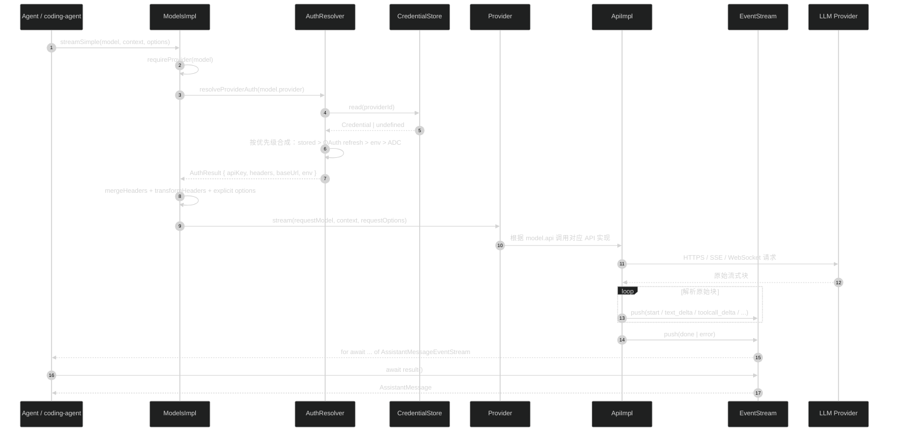
```mermaid
%%{init: {'theme':'dark', 'themeVariables': {'fontSize':'14px'}}}%%
sequenceDiagram
autonumber
participant Caller as Agent / coding-agent
participant Models as ModelsImpl
participant Auth as AuthResolver
participant CS as CredentialStore
participant Provider as Provider
participant API as ApiImpl
participant Events as EventStream
participant LLM as LLM Provider

Caller->>Models: streamSimple(model, context, options)
Models->>Models: requireProvider(model)
Models->>Auth: resolveProviderAuth(model.provider)
Auth->>CS: read(providerId)
CS-->>Auth: Credential | undefined
Auth->>Auth: 按优先级合成：stored > OAuth refresh > env > ADC
Auth-->>Models: AuthResult { apiKey, headers, baseUrl, env }
Models->>Models: mergeHeaders + transformHeaders + explicit options
Models->>Provider: stream(requestModel, context, requestOptions)
Provider->>API: 根据 model.api 调用对应 API 实现
API->>LLM: HTTPS / SSE / WebSocket 请求
LLM-->>API: 原始流式块
loop 解析原始块
  API->>Events: push(start / text_delta / toolcall_delta / ...)
end
API->>Events: push(done | error)
Events-->>Caller: for await ... of AssistantMessageEventStream
Caller->>Events: await result()
Events-->>Caller: AssistantMessage
```

**设计要点与不变量**

- **provider 是运行时单元**：每个 provider 自包含目录、认证、刷新逻辑；`Models` 只负责路由与 auth 合并；
- **目录与代码分离**：`models.generated.ts`（编译进包）与 `src/providers/data/` 是构建时生成的 provider/model 快照；动态 provider 通过 `refreshModels()` 拉取远端目录并写入 `ModelsStore`；
- **失败不抛，进流**：`stream*()` 的实现约定——请求/运行期失败必须编码为 `AssistantMessageEvent` 的 `error` 终止，而不是抛出；
- **auth 优先级**：显式 `options.apiKey` > auth/model headers > 已存储凭证 > 环境变量/ADC/ambient；OAuth token refresh 在 `CredentialStore.modify()` 内串行化，避免多进程竞速；
- **重试与超时**：`StreamOptions.maxRetries`、`maxRetryDelayMs`、`timeoutMs` 透传给各 provider SDK，由 SDK 自行实现重试；`Models` 层不额外包装重试。

## 3.2 pi-storage-sqlite-node（`@earendil-works/pi-storage-sqlite-node`）

一句话定位：为 `pi-agent-core` 提供的 **Node `node:sqlite` 后端实现**，让会话状态可落盘到本地 SQLite。

### 3.2.1 对外提供的接口

| 导出 | 形态 | 契约（一句话） | 调用方 |
|---|---|---|---|
| `createNodeSqliteFactory()` | 工厂 | 返回 `SqliteDatabaseFactory`，打开本地 SQLite 文件 | pi-agent-core harness 层 |
| `wrapNodeSqliteDatabase(db)` | 适配 | 把 `node:sqlite.DatabaseSync` 包装为 `SqliteDatabase` | 自定义初始化 |
| `SqliteSessionRepo` | 类 | 会话聚合根的读写、分支、物化视图 | pi-agent-core |
| `SqliteSessionStorage` | 类 | entry 级存储实现 | pi-agent-core |

### 3.2.2 内部结构

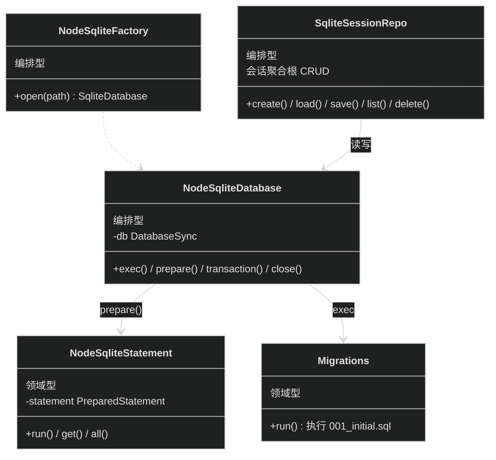
```mermaid
%%{init: {'theme':'dark', 'themeVariables': {'fontSize':'14px'}}}%%
classDiagram
    class NodeSqliteFactory {
        编排型
        +open(path) SqliteDatabase
    }
    class NodeSqliteDatabase {
        编排型
        -db DatabaseSync
        +exec() / prepare() / transaction() / close()
    }
    class NodeSqliteStatement {
        领域型
        -statement PreparedStatement
        +run() / get() / all()
    }
    class SqliteSessionRepo {
        编排型
        会话聚合根 CRUD
        +create() / load() / save() / list() / delete()
    }
    class Migrations {
        领域型
        +run() 执行 001_initial.sql
    }

    NodeSqliteFactory ..> NodeSqliteDatabase
    NodeSqliteDatabase --> NodeSqliteStatement : prepare()
    NodeSqliteDatabase --> Migrations : exec
    SqliteSessionRepo --> NodeSqliteDatabase : 读写
```

### 3.2.3 内部协作时序

核心场景：打开 SQLite 后端并完成首次迁移。

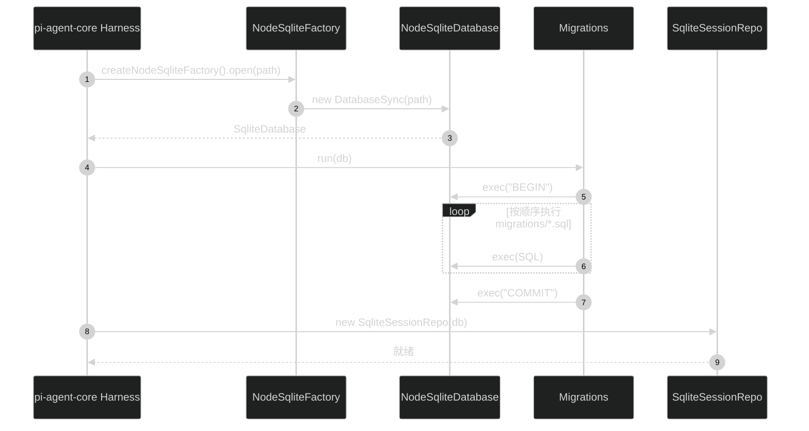
```mermaid
%%{init: {'theme':'dark', 'themeVariables': {'fontSize':'14px'}}}%%
sequenceDiagram
autonumber
participant Harness as pi-agent-core Harness
participant Factory as NodeSqliteFactory
participant DB as NodeSqliteDatabase
participant Migrations as Migrations
participant Repo as SqliteSessionRepo

Harness->>Factory: createNodeSqliteFactory().open(path)
Factory->>DB: new DatabaseSync(path)
DB-->>Harness: SqliteDatabase
Harness->>Migrations: run(db)
Migrations->>DB: exec("BEGIN")
loop 按顺序执行 migrations/*.sql
  Migrations->>DB: exec(SQL)
end
Migrations->>DB: exec("COMMIT")
Harness->>Repo: new SqliteSessionRepo(db)
Repo-->>Harness: 就绪
```

**设计要点**：`pi-agent-core` 只依赖 `SqliteDatabase`/`SqliteSessionRepo` 抽象，不直接依赖 Node 原生；未来其他语言/平台可替换为独立存储后端包。

## 3.3 pi-tui（`@earendil-works/pi-tui`）

一句话定位：**极简终端 UI 框架**，通过差分渲染与 CSI 2026 同步输出实现无闪烁、支持 IME 与内联图片的交互式 CLI 界面。

### 3.3.1 对外提供的接口

| 导出 | 形态 | 契约（一句话） | 调用方 |
|---|---|---|---|
| `TUI` | 类 | 组件容器、渲染调度、焦点与 Overlay 管理 | coding-agent interactive 模式 |
| `ProcessTerminal` | 类 | 标准终端抽象：stdin/stdout 原始模式、CSI 序列、大小变化 | TUI |
| `Component` / `Focusable` | 接口 | 组件必须实现 `render(width): string[]`，可选 `handleInput`、`invalidate` | 自定义组件 |
| `Container` / `Box` / `Text` / `Editor` / `Input` / `Markdown` / `SelectList` / `Image` / `Loader` | 组件类 | 内置组件库 | coding-agent UI |
| `showOverlay()` / `OverlayHandle` | API | 模态浮层：定位、显隐、焦点 | 对话框、选择器 |
| `matchesKey()` / keybinding 类型 | 辅助 | 键位匹配 | 组件与快捷键处理 |

### 3.3.2 内部结构

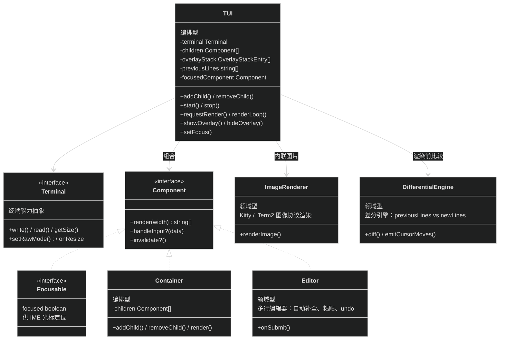
```mermaid
%%{init: {'theme':'dark', 'themeVariables': {'fontSize':'14px'}}}%%
classDiagram
    class TUI {
        编排型
        -terminal Terminal
        -children Component[]
        -overlayStack OverlayStackEntry[]
        -previousLines string[]
        -focusedComponent Component
        +addChild() / removeChild()
        +start() / stop()
        +requestRender() / renderLoop()
        +showOverlay() / hideOverlay()
        +setFocus()
    }
    class Terminal {
        <<interface>>
        终端能力抽象
        +write() / read() / getSize()
        +setRawMode() / onResize
    }
    class Component {
        <<interface>>
        +render(width) string[]
        +handleInput?(data)
        +invalidate?()
    }
    class Focusable {
        <<interface>>
        focused boolean
        供 IME 光标定位
    }
    class Container {
        编排型
        -children Component[]
        +addChild() / removeChild() / render()
    }
    class Editor {
        领域型
        多行编辑器：自动补全、粘贴、undo
        +onSubmit()
    }
    class ImageRenderer {
        领域型
        Kitty / iTerm2 图像协议渲染
        +renderImage()
    }
    class DifferentialEngine {
        领域型
        差分引擎：previousLines vs newLines
        +diff() / emitCursorMoves()
    }

    TUI --> Terminal
    TUI --> Component : 组合
    TUI --> DifferentialEngine : 渲染前比较
    Component <|.. Focusable
    Component <|.. Container
    Component <|.. Editor
    TUI --> ImageRenderer : 内联图片
```

### 3.3.3 内部协作时序

核心场景：用户输入导致界面变更，TUI 执行一次差分渲染。

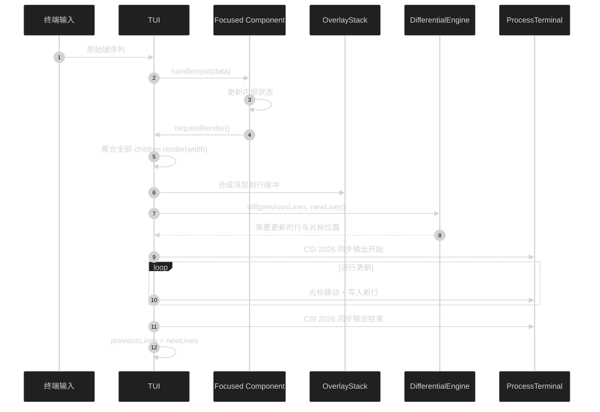
```mermaid
%%{init: {'theme':'dark', 'themeVariables': {'fontSize':'14px'}}}%%
sequenceDiagram
autonumber
participant Input as 终端输入
participant TUI as TUI
participant Focused as Focused Component
participant Overlays as OverlayStack
participant Diff as DifferentialEngine
participant Term as ProcessTerminal

Input->>TUI: 原始键序列
TUI->>Focused: handleInput(data)
Focused->>Focused: 更新内部状态
Focused->>TUI: requestRender()
TUI->>TUI: 聚合全部 children render(width)
TUI->>Overlays: 合成浮层到行缓冲
TUI->>Diff: diff(previousLines, newLines)
Diff-->>TUI: 需要更新的行与光标位置
TUI->>Term: CSI 2026 同步输出开始
loop 逐行更新
  TUI->>Term: 光标移动 + 写入新行
end
TUI->>Term: CSI 2026 同步输出结束
TUI->>TUI: previousLines = newLines
```

**设计要点与不变量**

- **差分优先**：仅在内容变化的行写入终端，配合 `MIN_RENDER_INTERVAL_MS=16ms` 避免刷屏；
- **CSI 2026 同步输出**：用 terminal 支持的同步更新帧消除撕裂与闪烁；
- **硬件光标与 IME**：`Focusable` 组件通过 `CURSOR_MARKER` 标记，TUI 在隐藏硬件光标的情况下仍能正确定位 IME 候选窗口；
- **透明锚点模式**：公共依赖（如终端写入）由 TUI 统一收口，组件不直接写 stdout；
- **并发模型**：单线程事件驱动，所有组件状态更新与渲染在主线程完成，无锁。

## 3.4 pi-agent-core（`@earendil-works/pi-agent-core`）

一句话定位：在 `pi-ai` 之上封装**有状态的通用 agent loop**，把一次性 LLM 流式调用编排成可持续多轮、可中断、可观测的 agent 会话。

### 3.4.1 对外提供的接口

| 导出 | 形态 | 契约（一句话） | 调用方 |
|---|---|---|---|
| `Agent` | 类 | `prompt()` / `continue()` / `abort()` / `waitForIdle()` / `reset()` / `subscribe()`；单 `activeRun` 独占 | coding-agent `AgentSession` |
| `agentLoop()` / `agentLoopContinue()` | 函数 | 低层无状态 loop，返回 `EventStream<AgentEvent, AgentMessage[]>` | Agent 内部、直接宿主 |
| `runAgentLoop()` / `runAgentLoopContinue()` | 函数 | 带 sink 回调版 | Agent 内部 |
| `setDefaultStreamFn()` | 函数 | 宿主注入默认 `StreamFn`（通常是 `pi-ai` 的 `streamSimple`） | coding-agent sdk.ts |
| `AgentTool` / `AgentToolResult` | 类型/接口 | 扩展 pi-ai Tool，增加 `label`、`prepareArguments`、`execute`、tool result 语义 | coding-agent 工具工厂 |
| `AgentState` / `AgentEvent` / `AgentMessage` / `AgentContext` | 类型 | 会话状态、事件协议、消息模型、上下文 hook | 上层 |
| `Session` / 内存/JSONL storage / `compact()` | harness 子层 | 树形会话、持久化、压缩 | coding-agent 可选 |

### 3.4.2 内部结构

```mermaid
%%{init: {'theme':'dark', 'themeVariables': {'fontSize':'14px'}}}%%
classDiagram
    class Agent {
        编排型
        -state AgentState
        -activeRun ActiveRun
        -abortController AbortController
        +prompt() / continue() / abort()
        +subscribe() / reset() / waitForIdle()
        -processEvents()
    }
    class ActiveRun {
        值对象
        -abortController AbortController
        -settled Promise~void~
    }
    class AgentLoop {
        编排型
        双层 while：外层 follow-up、内层 tool/steering
        +runLoop() / runLoopContinue()
        -streamAssistantResponse()
        -executeToolCallsSequential()
        -executeToolCallsParallel()
        -prepareToolCall() / finalizeExecutedToolCall()
    }
    class AgentState {
        领域型
        可写：systemPrompt / model / thinkingLevel / tools / messages
        只读：isStreaming / streamingMessage / pendingToolCalls / errorMessage
        +归约事件更新状态
    }
    class AgentTool {
        领域型
        扩展 pi-ai Tool
        -label / executionMode
        +prepareArguments?() / execute()
        +AgentToolResult { content, details, usage, terminate? }
    }
    class PendingMessageQueue {
        领域型
        steering / follow-up 消息队列
        +enqueue() / dequeue()
    }
    class EventStream~T,R~ {
        领域型
        push / yield / result
    }

    Agent --> AgentLoop : 委托 loop 执行
    Agent --> AgentState : 持有并归约更新
    Agent --> PendingMessageQueue : 注入 steering/follow-up
    Agent --> EventStream : 消费 AgentEvent
    AgentLoop --> AgentTool : 执行 tool call
```

**AgentState 关键不变量**

- `RUNNING ⇔ 存在 activeRun`：一次只能有一个 run 在执行；新 `prompt()` 在 `activeRun` 存在时 throw；
- 事件序列恒闭合：每个 `agent_start` 必有对应的 `agent_end`，每个 `turn_start` 必有 `turn_end`；
- `messages` 数组赋值时顶层拷贝，避免上层直接修改导致状态漂移；
- tool 执行失败必须 throw，由 loop 捕获并转为 `isError=true` 的 toolResult 回喂模型。

### 3.4.3 内部协作时序

核心场景：`Agent.prompt()` 触发一轮 LLM + 工具执行循环。

```mermaid
%%{init: {'theme':'dark', 'themeVariables': {'fontSize':'14px'}}}%%
sequenceDiagram
autonumber
participant Caller as coding-agent AgentSession
participant Agent as Agent
participant Queue as PendingMessageQueue
participant Loop as AgentLoop
participant StreamFn as StreamFn(pi-ai)
participant Tool as AgentTool

Caller->>Agent: prompt(userMessage)
Agent->>Agent: 检查 activeRun，创建 AbortController
Agent->>Agent: push agent_start / turn_start / message_start/end
Agent->>Queue: pull steering
Queue-->>Agent: steering messages
Agent->>Loop: runLoop(state, options)

Loop->>Loop: transformContext() 可选剪枝
Loop->>Loop: convertToLlm() AgentMessage[] → Message[]
Loop->>StreamFn: streamSimple(model, context)
StreamFn-->>Loop: AssistantMessageEventStream
loop 消费流式事件
  StreamFn-->>Loop: text_delta / thinking_delta / toolcall_delta
  Loop->>Agent: message_update
end
StreamFn-->>Loop: done (stopReason)

alt stopReason = toolUse
  Loop->>Loop: preflight：prepareArguments + validate + beforeToolCall
  alt parallel 模式
    Loop->>Tool: execute(toolCallId, params, signal, onUpdate) 并发
    Tool-->>Loop: tool_execution_update
    Tool-->>Loop: tool_execution_end
  else sequential 模式
    Loop->>Tool: 逐个顺序执行
  end
  Loop->>Loop: finalize：按 assistant 源序生成 toolResult messages
  Loop->>Loop: 追加到 state.messages，触发下一轮 LLM
  Loop->>StreamFn: streamSimple(...)
end

Loop-->>Agent: 流结束，发 turn_end / agent_end
Agent->>Agent: activeRun 结算
Agent-->>Caller: AgentEvent 流 + Promise resolve
```

**设计要点**

- **单 AbortController 贯穿**：streamFn、hooks、tool execute 共享同一个 `signal`，取消时一层层传播；
- **turn 的边界**：一次 LLM 响应 + 该响应触发的全部 tool 执行 = 一个 turn；steering 在 turn 边界注入，follow-up 在"本该停止"时检查；
- **parallel vs sequential**：默认并行；同一批次内任一 tool 声明 `executionMode: "sequential"` 则整批顺序执行；
- **截断保护**：`stopReason === "length"` 时整批 tool call 拒绝执行，避免在上下文截断场景产生无效工具调用；
- **持久化解耦**：核心层不持久化，会话持久化与压缩放在 harness 子层，SQLite 后端拆为独立包。

## 3.5 pi-coding-agent（`@earendil-works/pi-coding-agent`）

一句话定位：**Pi 的核心交付物**，把 `pi-agent-core` 的通用 agent 运行时包装成面向终端用户的 coding harness，提供四种运行模式、内置工具、扩展体系、会话树与压缩、信任门和配置管理。

### 3.5.1 对外提供的接口

**CLI 主要命令/选项**（同 2.2 接口①，此处按模式补充）

| 接口/方法 | 契约（一句话） | 调用方 |
|---|---|---|
| `pi`（默认） | 进入交互 TUI | 终端用户 |
| `pi -p <prompt>` | print 模式，单轮输出后退出 | 脚本/管道 |
| `pi --mode json` | JSONL 事件流输出 | 自动化工具 |
| `pi --mode rpc` | stdio JSONL RPC 服务 | 编辑器/外部进程 |
| `pi install/remove/update/list/config` | Pi package 管理 | 用户/CI |
| `pi --export <in> [out]` | 把会话导出为 HTML | 用户 |

**SDK 核心导出**（分组）

| 接口/方法 | 契约（一句话） | 调用方 |
|---|---|---|
| `createAgentSession()` | 创建绑定到 cwd 的 `AgentSession` | Node.js 宿主 |
| `AgentSession.prompt()` / `steer()` / `followUp()` | 输入与队列 | 宿主 |
| `AgentSession.compact()` / `setModel()` / `abort()` / `subscribe()` | 压缩、模型切换、取消、事件订阅 | 宿主 |
| `createCodingTools()` / `createReadOnlyTools()` / 各 `create*Tool()` | 内置工具工厂 | 扩展/宿主 |
| `ModelRuntime` / `ModelRegistry` | provider/model/凭证运行时 | 宿主 |
| `InteractiveMode` / `runPrintMode` / `runRpcMode` / `RpcClient` | 模式入口与客户端 | 宿主/编辑器 |
| `ExtensionAPI` / `ExtensionFactory` / `ToolDefinition` / `Skill` / `PromptTemplate` | 扩展类型 | 扩展作者 |

**RPC 协议命令分组**（节选，同 2.2 接口③）

| 接口/方法 | 契约（一句话） | 调用方 |
|---|---|---|
| `prompt { text, files? }` | 提交用户输入 | RPC 客户端 |
| `steer` / `follow_up` | 在运行中/结束后注入消息 | RPC 客户端 |
| `abort` | 取消当前 agent run | RPC 客户端 |
| `get_state` / `get_messages` | 读取会话状态与消息 | RPC 客户端 |
| `set_model` / `cycle_model` | 切换模型 | RPC 客户端 |
| `compact` | 触发上下文压缩 | RPC 客户端 |
| `switch_session` / `fork` / `clone` | 会话树导航 | RPC 客户端 |

### 3.5.2 内部结构

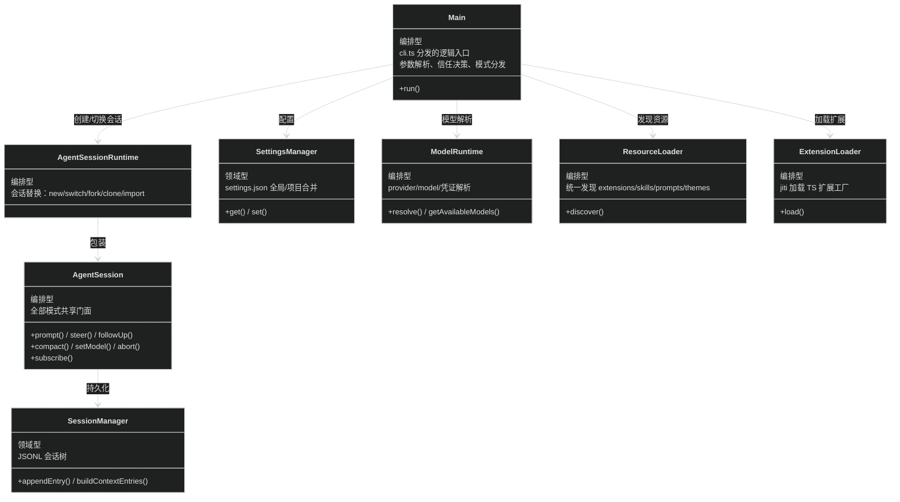
```mermaid
%%{init: {'theme':'dark', 'themeVariables': {'fontSize':'14px'}}}%%
classDiagram
%% 主图：核心服务组装
    class Main {
        编排型
        cli.ts 分发的逻辑入口
        参数解析、信任决策、模式分发
        +run()
    }
    class AgentSession {
        编排型
        全部模式共享门面
        +prompt() / steer() / followUp()
        +compact() / setModel() / abort()
        +subscribe()
    }
    class AgentSessionRuntime {
        编排型
        会话替换：new/switch/fork/clone/import
    }
    class SessionManager {
        领域型
        JSONL 会话树
        +appendEntry() / buildContextEntries()
    }
    class SettingsManager {
        领域型
        settings.json 全局/项目合并
        +get() / set()
    }
    class ModelRuntime {
        编排型
        provider/model/凭证解析
        +resolve() / getAvailableModels()
    }
    class ResourceLoader {
        编排型
        统一发现 extensions/skills/prompts/themes
        +discover()
    }
    class ExtensionLoader {
        编排型
        jiti 加载 TS 扩展工厂
        +load()
    }

    Main --> AgentSessionRuntime : 创建/切换会话
    Main --> SettingsManager : 配置
    Main --> ModelRuntime : 模型解析
    Main --> ResourceLoader : 发现资源
    Main --> ExtensionLoader : 加载扩展
    AgentSessionRuntime --> AgentSession : 包装
    AgentSession --> SessionManager : 持久化
```

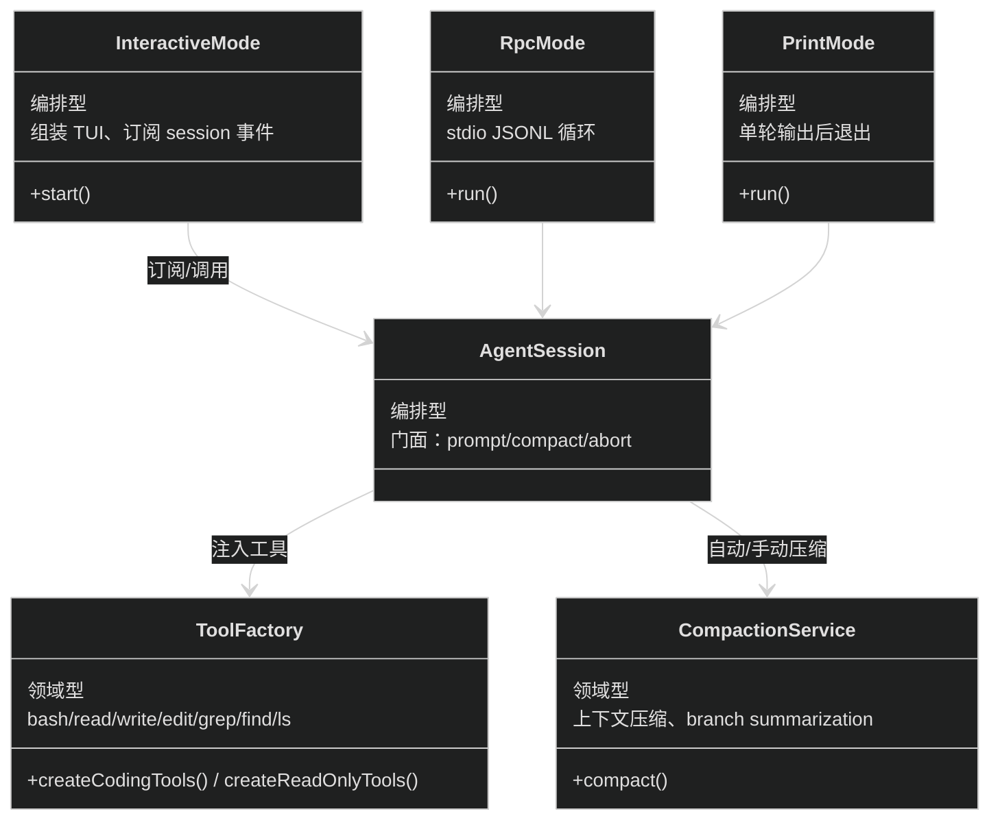
```mermaid
%%{init: {'theme':'dark', 'themeVariables': {'fontSize':'14px'}}}%%
classDiagram
%% 子图：模式、工具与压缩
    class InteractiveMode {
        编排型
        组装 TUI、订阅 session 事件
        +start()
    }
    class RpcMode {
        编排型
        stdio JSONL 循环
        +run()
    }
    class PrintMode {
        编排型
        单轮输出后退出
        +run()
    }
    class AgentSession {
        编排型
        门面：prompt/compact/abort
    }
    class ToolFactory {
        领域型
        bash/read/write/edit/grep/find/ls
        +createCodingTools() / createReadOnlyTools()
    }
    class CompactionService {
        领域型
        上下文压缩、branch summarization
        +compact()
    }

    InteractiveMode --> AgentSession : 订阅/调用
    RpcMode --> AgentSession
    PrintMode --> AgentSession
    AgentSession --> ToolFactory : 注入工具
    AgentSession --> CompactionService : 自动/手动压缩
```

### 3.5.3 内部协作时序

核心场景：从 CLI 启动到完成一次交互式 prompt 响应。

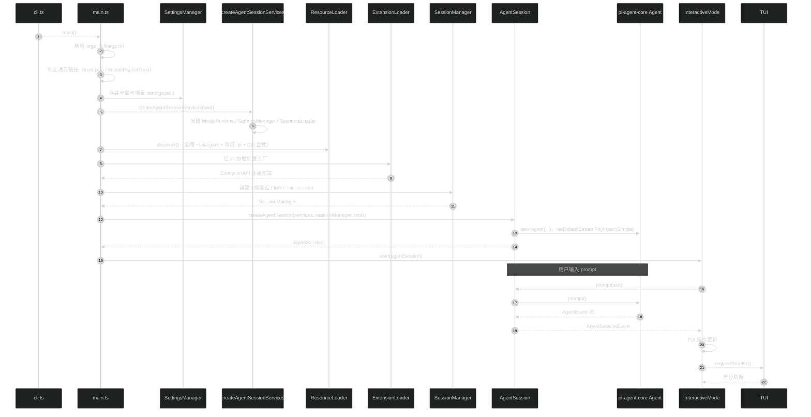
```mermaid
%%{init: {'theme':'dark', 'themeVariables': {'fontSize':'14px'}}}%%
sequenceDiagram
autonumber
participant CLI as cli.ts
participant Main as main.ts
participant Settings as SettingsManager
participant Services as createAgentSessionServices
participant Loader as ResourceLoader
participant Ext as ExtensionLoader
participant SessionMgr as SessionManager
participant AgentSession as AgentSession
participant Agent as pi-agent-core Agent

CLI->>Main: main()
Main->>Main: 解析 args（cli/args.ts）
Main->>Main: 判定项目信任（trust.json / defaultProjectTrust）
Main->>Settings: 合并全局与项目 settings.json
Main->>Services: createAgentSessionServices(cwd)
Services->>Services: 创建 ModelRuntime / SettingsManager / ResourceLoader
Main->>Loader: discover()（全局 ~/.pi/agent + 项目 .pi + CLI 显式）
Main->>Ext: 经 jiti 加载扩展工厂
Ext-->>Main: ExtensionAPI 注册完成
Main->>SessionMgr: 新建 / 续最近 / fork / --no-session
SessionMgr-->>Main: SessionManager
Main->>AgentSession: createAgentSession(services, sessionManager, tools)
AgentSession->>Agent: new Agent(...)，setDefaultStreamFn(streamSimple)
AgentSession-->>Main: AgentSession
Main->>InteractiveMode: start(agentSession)

Note over AgentSession,Agent: 用户输入 prompt
InteractiveMode->>AgentSession: prompt(text)
AgentSession->>Agent: prompt()
Agent-->>AgentSession: AgentEvent 流
AgentSession-->>InteractiveMode: AgentSessionEvent
InteractiveMode->>InteractiveMode: TUI 组件更新
InteractiveMode->>TUI: requestRender()
TUI-->>InteractiveMode: 差分刷新
```

**设计要点**

- **单一核心、四种外壳**：`AgentSession` 是共享业务核心，interactive/print/json/rpc 只是 I/O 层；SDK 与 CLI 共用 `createAgentSession()`；
- **扩展是一等公民**：30+ 事件覆盖启动、输入、provider 请求/响应、工具调用前后、compaction/tree、会话切换全生命周期；扩展可注册工具/命令/快捷键/CLI flag/provider/渲染器，甚至替换编辑器与 footer；
- **jiti + virtualModules**：TS 扩展免编译加载，同一机制在 npm 安装与 Bun 单文件二进制下都可用；内置 llama.cpp 支持本身即用扩展 API 实现；
- **会话即树、一切落盘**：JSONL + id/parentId 树使分支零成本；compaction/branch_summary/custom entry 全部是会话树节点；上下文是从 leaf 回溯的物化视图；
- **资源发现统一管线**：extensions/skills/prompts/themes 都按"全局 `~/.pi/agent` → 项目 `.pi` → pi package → settings 数组 → CLI 显式"的优先级发现；项目级资源必须过信任门；
- **明确的安全边界声明**：进程内不实现半吊子沙盒；项目信任只是"输入加载守卫"，真实隔离交给容器/VM（`docs/containerization.md`）。

## 3.6 pi-server（`@earendil-works/pi-server`）

一句话定位：**实验性 headless 多实例守护进程**，在本机 socket 上提供 JSONL IPC，监管若干 `pi --mode rpc` 子进程，把 CLI/Radius 云桥接到各实例。

### 3.6.1 对外提供的接口

| 接口/方法 | 契约（一句话） | 调用方 |
|---|---|---|
| CLI `pi-server serve` | 启动守护进程 | 系统管理员/启动脚本 |
| CLI `pi-server list/status/stop` | 查询与停止实例 | 客户端 |
| CLI `pi-server spawn {cwd,label}` | 请求创建新实例 | 客户端 |
| CLI `pi-server rpc` / `rpc-stream` | 向某实例发送命令或建立长连接 | 客户端 |
| IPC `spawn/list/status/stop/rpc/rpc_stream` | socket JSONL 请求 | pi-server CLI 客户端 |
| Radius presence | 向 `radius.pi.dev/v1/` 注册/心跳 | Radius 云 |

### 3.6.2 内部结构

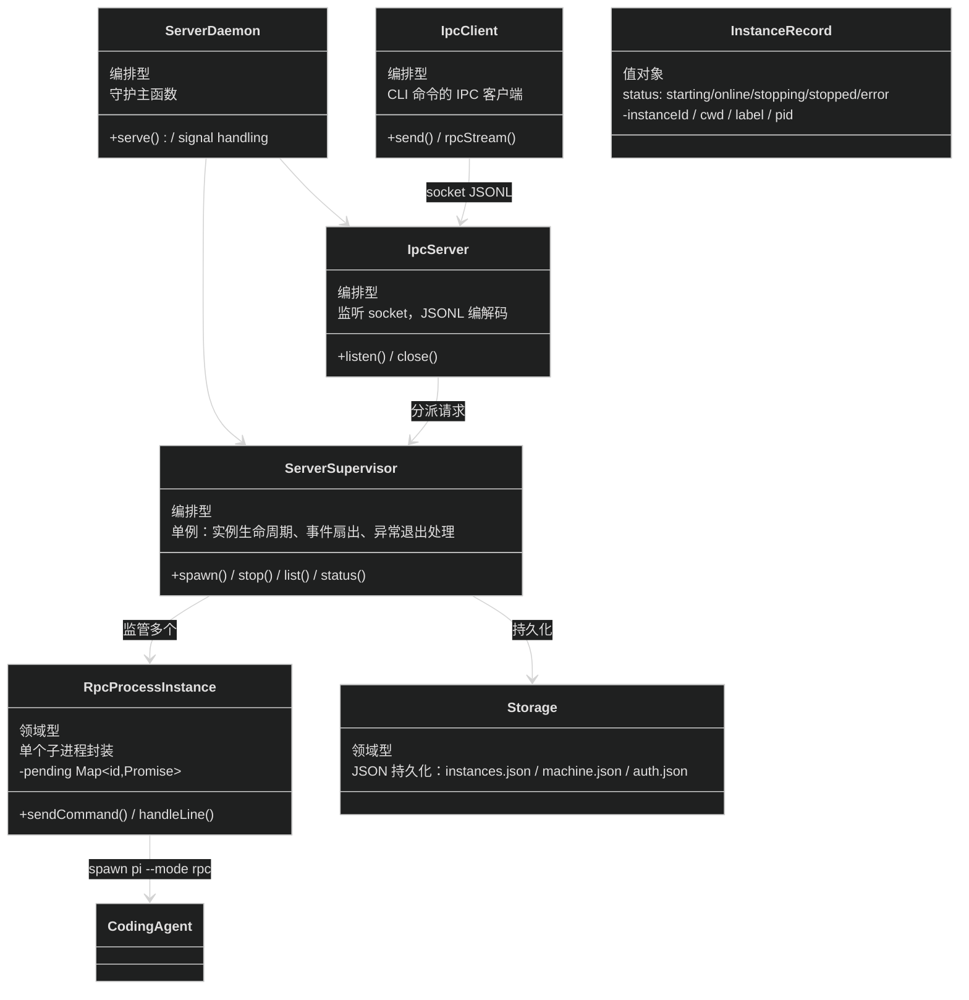
```mermaid
%%{init: {'theme':'dark', 'themeVariables': {'fontSize':'14px'}}}%%
classDiagram
    class ServerDaemon {
        编排型
        守护主函数
        +serve() / signal handling
    }
    class IpcServer {
        编排型
        监听 socket，JSONL 编解码
        +listen() / close()
    }
    class IpcClient {
        编排型
        CLI 命令的 IPC 客户端
        +send() / rpcStream()
    }
    class ServerSupervisor {
        编排型
        单例：实例生命周期、事件扇出、异常退出处理
        +spawn() / stop() / list() / status()
    }
    class RpcProcessInstance {
        领域型
        单个子进程封装
        -pending Map~id,Promise~
        +sendCommand() / handleLine()
    }
    class InstanceRecord {
        值对象
        status: starting/online/stopping/stopped/error
        -instanceId / cwd / label / pid
    }
    class Storage {
        领域型
        JSON 持久化：instances.json / machine.json / auth.json
    }

    ServerDaemon --> IpcServer
    ServerDaemon --> ServerSupervisor
    IpcServer --> ServerSupervisor : 分派请求
    IpcClient --> IpcServer : socket JSONL
    ServerSupervisor --> RpcProcessInstance : 监管多个
    ServerSupervisor --> Storage : 持久化
    RpcProcessInstance --> CodingAgent : spawn pi --mode rpc
```

### 3.6.3 内部协作时序

核心场景：`spawn` 一个 `pi --mode rpc` 实例并建立 `rpc_stream`。

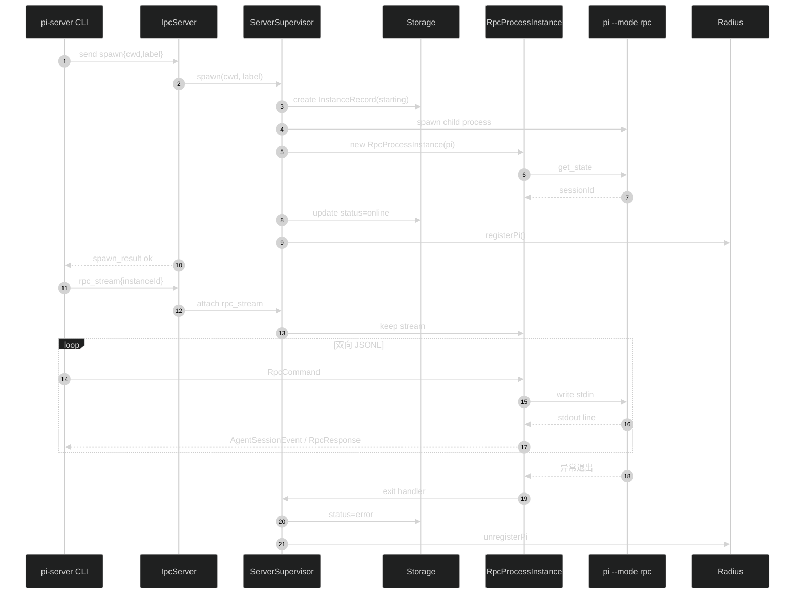
```mermaid
%%{init: {'theme':'dark', 'themeVariables': {'fontSize':'14px'}}}%%
sequenceDiagram
autonumber
participant Client as pi-server CLI
participant Ipc as IpcServer
participant Supervisor as ServerSupervisor
participant Storage as Storage
participant Process as RpcProcessInstance
participant Pi as pi --mode rpc
participant Radius as Radius

Client->>Ipc: send spawn{cwd,label}
Ipc->>Supervisor: spawn(cwd, label)
Supervisor->>Storage: create InstanceRecord(starting)
Supervisor->>Pi: spawn child process
Supervisor->>Process: new RpcProcessInstance(pi)
Process->>Pi: get_state
Pi-->>Process: sessionId
Supervisor->>Storage: update status=online
Supervisor->>Radius: registerPi()
Ipc-->>Client: spawn_result ok

Client->>Ipc: rpc_stream{instanceId}
Ipc->>Supervisor: attach rpc_stream
Supervisor->>Process: keep stream
loop 双向 JSONL
  Client->>Process: RpcCommand
  Process->>Pi: write stdin
  Pi-->>Process: stdout line
  Process-->>Client: AgentSessionEvent / RpcResponse
end
Pi-->>Process: 异常退出
Process->>Supervisor: exit handler
Supervisor->>Storage: status=error
Supervisor->>Radius: unregisterPi
```

**设计要点**

- **自身不含 agent 逻辑**：只负责进程监管与协议桥接；所有 agent 能力来自 `pi-coding-agent` 的 rpc 模式；
- **本地 socket 为唯一监听面**：无网络监听，安全边界依赖文件系统权限；
- **Radius presence 可选**：用于在本地网络/云侧发现可用实例；
- **协议复用**：命令类型与 `AgentSessionEvent` 全部复用 `pi-coding-agent` 的 `rpc-types.ts`。

## 3.7 pi-evals（`@earendil-works/pi-evals`）

一句话定位：面向真实模型的**端到端行为评测包**，在隔离临时目录中把 coding-agent 的 `AgentSession` 跑起来做断言，不发布、无构建。

### 3.7.1 对外提供的接口

| 接口/方法 | 契约（一句话） | 调用方 |
|---|---|---|
| `scripts/run-evals.mjs --provider 
 --model <m>` | 以指定 provider/model 运行 vitest eval | 评测 CI/开发者 |
| `createPiCodingAgentHarness()` | 创建隔离评测 harness | eval 用例 |

### 3.7.2 内部结构

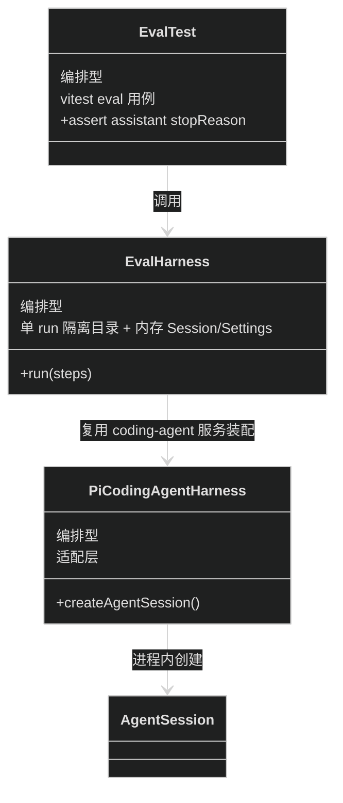
```mermaid
%%{init: {'theme':'dark', 'themeVariables': {'fontSize':'14px'}}}%%
classDiagram
    class EvalHarness {
        编排型
        单 run 隔离目录 + 内存 Session/Settings
        +run(steps)
    }
    class PiCodingAgentHarness {
        编排型
        适配层
        +createAgentSession()
    }
    class EvalTest {
        编排型
        vitest eval 用例
        +assert assistant stopReason
    }

    EvalTest --> EvalHarness : 调用
    EvalHarness --> PiCodingAgentHarness : 复用 coding-agent 服务装配
    PiCodingAgentHarness --> AgentSession : 进程内创建
```

### 3.7.3 内部协作时序

核心场景：运行一个 eval 用例。

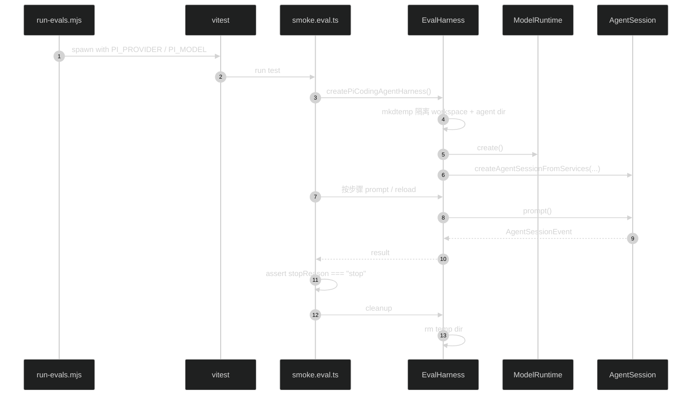
```mermaid
%%{init: {'theme':'dark', 'themeVariables': {'fontSize':'14px'}}}%%
sequenceDiagram
autonumber
participant Runner as run-evals.mjs
participant Vitest as vitest
participant Test as smoke.eval.ts
participant Harness as EvalHarness
participant ModelRuntime as ModelRuntime
participant AgentSession as AgentSession

Runner->>Vitest: spawn with PI_PROVIDER / PI_MODEL
Vitest->>Test: run test
Test->>Harness: createPiCodingAgentHarness()
Harness->>Harness: mkdtemp 隔离 workspace + agent dir
Harness->>ModelRuntime: create()
Harness->>AgentSession: createAgentSessionFromServices(...)
Test->>Harness: 按步骤 prompt / reload
Harness->>AgentSession: prompt()
AgentSession-->>Harness: AgentSessionEvent
Harness-->>Test: result
Test->>Test: assert stopReason === "stop"
Test->>Harness: cleanup
Harness->>Harness: rm temp dir
```

**设计要点**

- **强隔离**：每个 eval run 独立临时目录 + 内存态，避免污染开发者真实 `~/.pi/agent`；
- **显式模型选择**：绝不回退默认模型，必须由 `--provider`/`--model` 或环境变量指定；
- **复用而非复制**：不经 server/TUI，直接进程内复用 `pi-coding-agent` 的服务装配 API——与 `pi-server` 的 rpc 子进程模式并列，是 coding-agent 的两种宿主方式之一。

---

# 4 跨层依赖与数据流总览

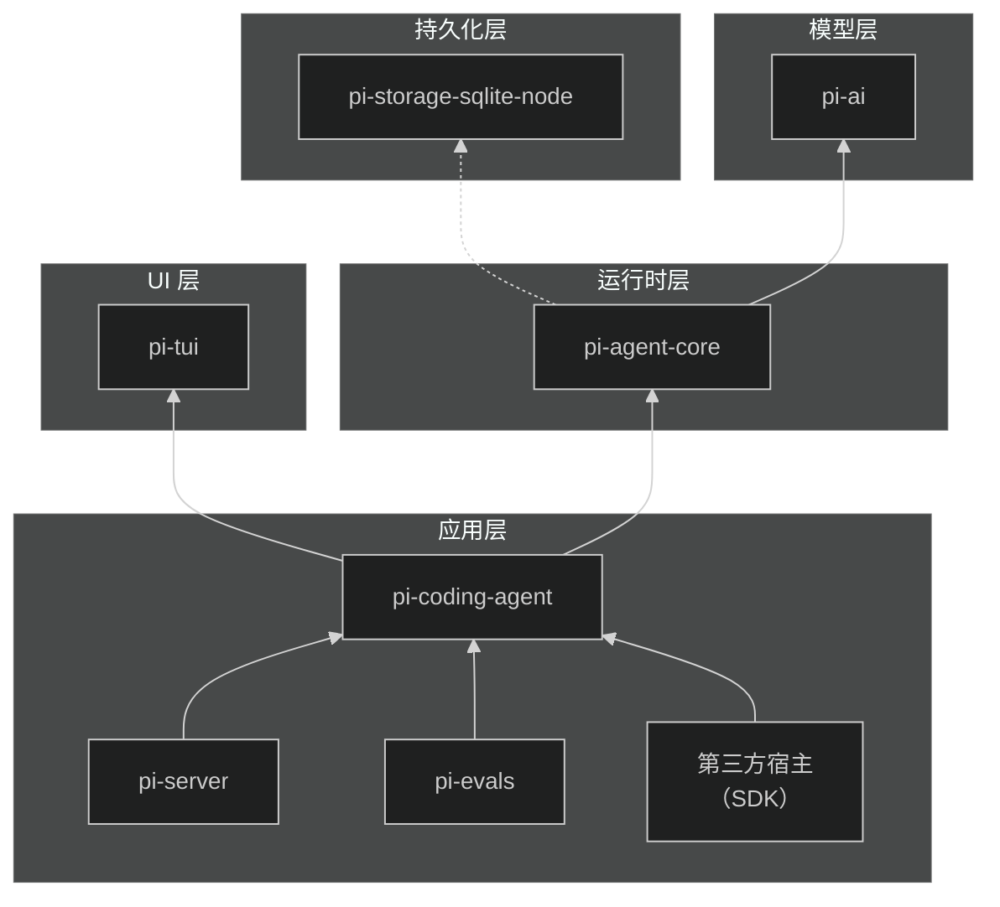
```mermaid
%%{init: {'theme':'dark', 'themeVariables': {'fontSize':'14px'}}}%%
flowchart BT
    subgraph App["应用层"]
        CodingAgent["pi-coding-agent"]
        Server["pi-server"]
        Evals["pi-evals"]
        HostApps["第三方宿主<br/>（SDK）"]
    end
    subgraph Runtime["运行时层"]
        AgentCore["pi-agent-core"]
    end
    subgraph UILayer["UI 层"]
        TUI["pi-tui"]
    end
    subgraph Model["模型层"]
        AI["pi-ai"]
    end
    subgraph StorageLayer["持久化层"]
        Storage["pi-storage-sqlite-node"]
    end

    CodingAgent --> AgentCore
    CodingAgent --> TUI
    Server --> CodingAgent
    Evals --> CodingAgent
    HostApps --> CodingAgent
    AgentCore --> AI
    AgentCore -.-> Storage
```

> 关键约定：箭头表示编译期依赖 + 运行期调用；`pi-agent-core` 与 `pi-storage-sqlite-node` 之间是可选依赖（harness 层根据配置决定是否注入 SQLite 后端），故用虚线。

---

# 5 部署与运行形态

Pi 以 npm 包、Bun 单文件二进制、源码三种形态分发：

| 形态 | 入口 | 说明 |
|---|---|---|
| npm 包 | `npx pi` / `npm install -g @earendil-works/pi-coding-agent` | 依赖 Node ≥22.19.0，使用 root lockfile 与 shrinkwrap |
| Bun 二进制 | 独立可执行文件 `pi` | 单文件分发，内置 llama.cpp 扩展与 native 预编译模块 |
| 源码 | `npm install --ignore-scripts && npm run build` | 开发/贡献者 |

运行时数据默认放在 `~/.pi/agent/`：

- `~/.pi/agent/settings.json`：全局配置
- `~/.pi/agent/auth.json`：provider 凭证（权限 0600）
- `~/.pi/agent/sessions/`：JSONL 会话树
- `~/.pi/agent/extensions/`、`skills/`、`prompts/`、`themes/`：用户级扩展资源
- `~/.pi/agent/npm/`、`git/`：已安装的 Pi packages
- 项目级 `.pi/` 目录：项目 settings、扩展、技能、模板、主题（需信任）

`pi-server` 独立使用 `~/.pi/server/`：instances、machine、auth、socket。

---

# 6 安全与隔离声明

Pi 在进程内**不实现权限沙盒**，原因见 `docs/security.md`：

- 默认以启动用户的权限运行，可访问文件系统、进程、网络、凭证；
- 项目级扩展/技能加载前需通过 `trust.json` 或交互式信任门确认，但这只是**输入加载守卫**，不是安全边界；
- 需要强隔离时，应容器化或沙盒化 Pi，官方文档提供三种模式：Gondolin 扩展（host 保留 Pi 与 provider auth，工具路由到本地 Linux micro-VM）、Plain Docker、OpenShell 策略沙盒。

---

# 7 关键设计决策摘要

决策详情见同目录 `pi-agent-harness-decisions.md`。主要结论：

1. **系统边界**：以整个 monorepo 为设计对象，`pi-coding-agent` 作为核心交付物重点展开；
2. **信息来源**：以本地源码与仓内 docs/ 为唯一事实来源，不依赖外部网站；
3. **文档定位**：as-is 还原既有系统设计，不提出改进建议；
4. **语言与路径**：中文写作，产物位于 `D:\02-Dev\pi\design-docs\`。
