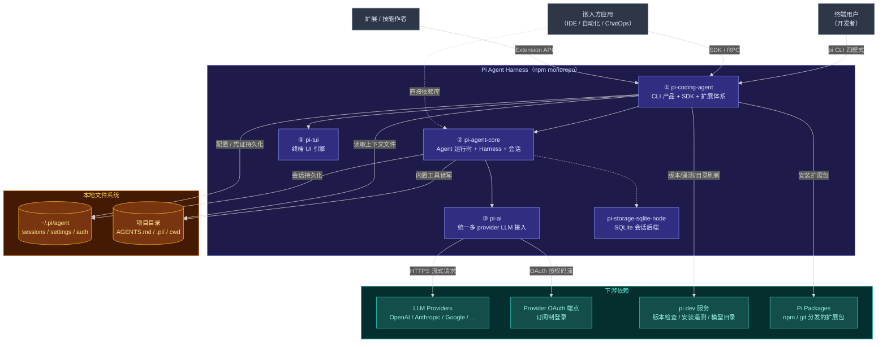
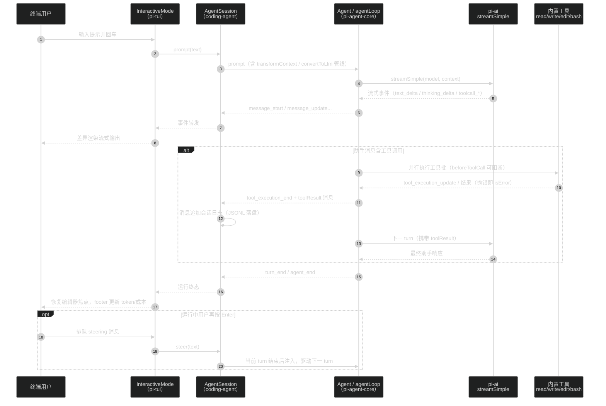
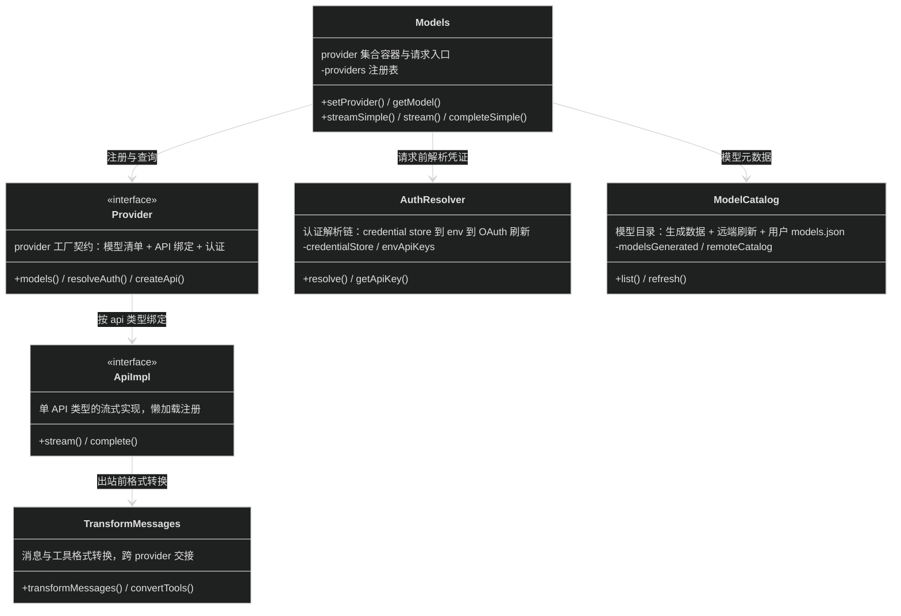
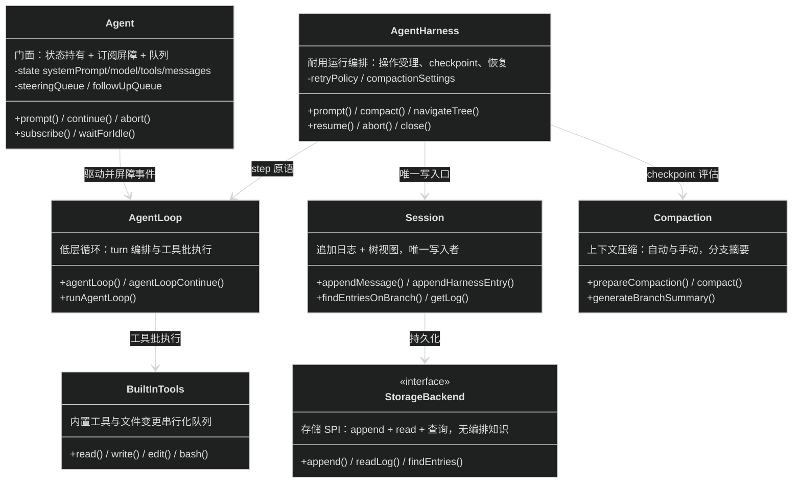
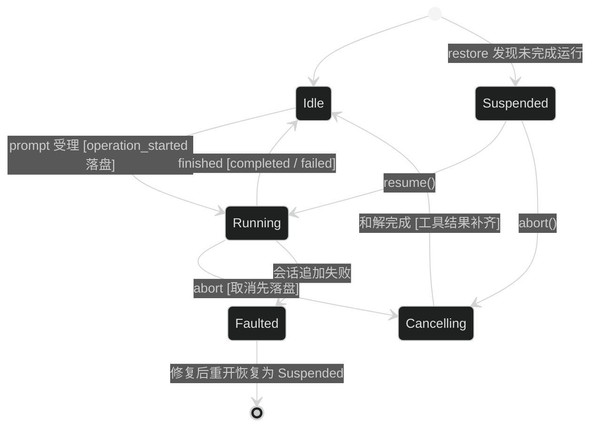
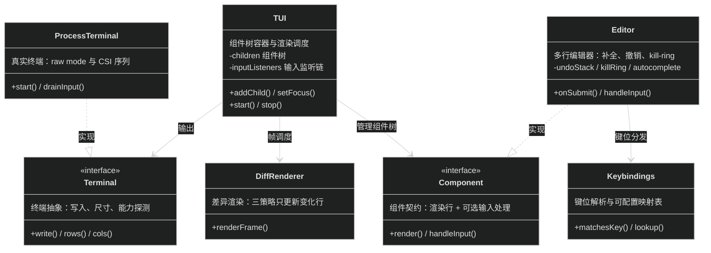
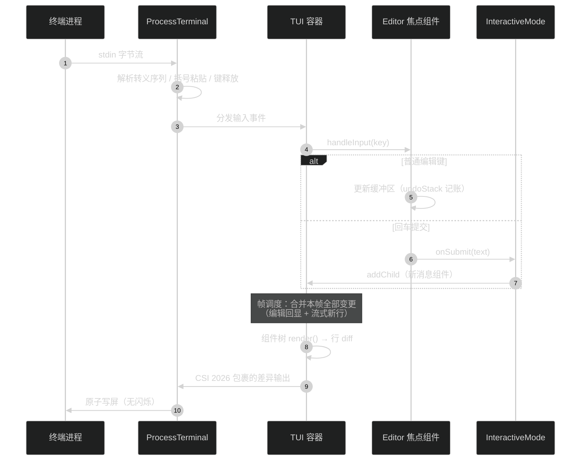
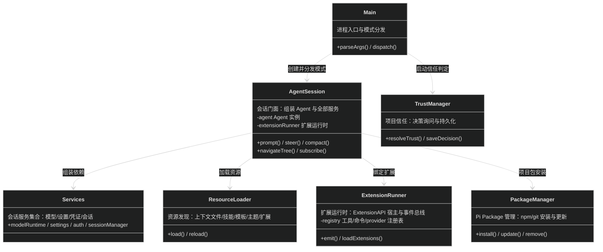
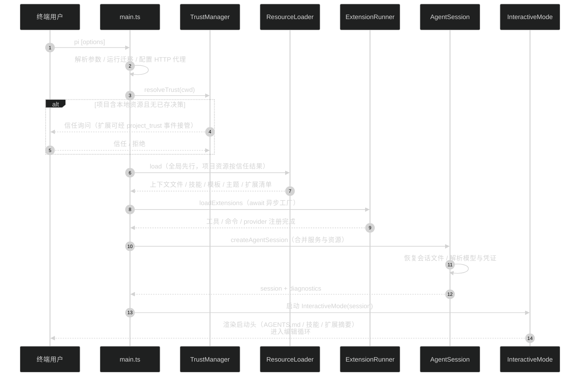

# Pi Agent Harness 系统设计文档

> 本文档基于仓库代码与文档（`packages/*/README.md`、`packages/agent/docs/`、`packages/coding-agent/docs/`）整理，描述 Pi Agent Harness monorepo 的现状架构。决策提取过程见同目录 [pi-decisions.md](pi-decisions.md)。

---

## 全局绘图规范

- 统一使用 mermaid 绘图，图源内嵌在 Markdown 中；
- 每张图的节点 / 参与者控制在 5~9 个以内；超限时用 subgraph 分组或拆"主图 + 子图"；
- 公共依赖线优先从实际负责的具体模块引出（可拆多条带标签的线）；隐形锚点节点仅用于无法归属到具体模块的全系统公共依赖，且图下须配图例；不从 subgraph 整框直接引边；
- 类图按 Sketch 模式速写（名称 + 一句语义），方法行必须含 `()`；
- 样式复用 dark theme init 头 + classDef 配色约定。

---

# 1 需求背景与目标

## 1.1 背景与问题

构建一个终端里的 AI 编码助手，要同时面对四类具体痛点：

- **LLM 供应商碎片化**：各家 API（OpenAI Completions/Responses、Anthropic Messages、Google Generative AI、Bedrock Converse…）在消息格式、工具调用协议、流式事件、推理（thinking）参数、缓存控制上互不兼容；认证方式混杂（API key、OAuth 订阅、云平台凭证）。每个 agent 应用各自实现一遍，接入一个新 provider 成本以周计；
- **编码 agent 产品功能固化**：现有产品把子代理、计划模式、权限体系等意见化功能焊死在内核里，用户想适配自己的工作流只能 fork 改源码，随后被上游升级拖死；
- **终端 UI 体验差**：交互式 CLI 整屏重绘导致闪烁，大段粘贴、终端图片、键位定制支持参差，流式渲染与键盘输入互相打架；
- **agent 运行不耐用**：一次"提示 → 多轮工具调用"的运行中途进程崩溃，会话状态与执行进度全部丢失，无法从安全边界续跑；长会话还会撞 context 窗口，需要压缩而不丢历史。

问题根源在于处理对象的特点：agentic 工作流是"LLM 流式生成 × 工具副作用 × 长程会话状态"三者交织，而这三者分别属于接入层、运行时、存储层——耦合在一个产品里必然顾此失彼。因此 Pi 按层拆分为四个可独立复用的包（D1），产品层坚持扩展优先（D2），运行时把会话建模为可恢复的追加日志（D3/D4）。

供应链安全是硬约束：CLI 以用户本机权限执行 bash 命令，依赖投毒即 RCE，因此依赖钉版、lockfile 为事实源、安装禁生命周期脚本（D7）。

## 1.2 方案目标：范围内 / 范围外

| 范围内（本项目做） | 范围外（本项目不做，由谁负责） |
|---|---|
| 统一多 provider LLM 接入：消息格式转换、流式、工具调用、认证解析、token/成本统计（pi-ai） | 模型本身与 provider 服务端（各 LLM 供应商） |
| Agent 运行时：工具执行循环、事件流、steering/follow-up 队列、可恢复会话、上下文压缩（pi-agent-core） | 沙箱隔离与权限系统（外部容器化：Gondolin / Docker / OpenShell，见 D6） |
| 终端 UI 引擎：差异渲染、同步输出、编辑器组件（pi-tui） | 终端模拟器本身（用户的 terminal，项目提供适配文档） |
| CLI 产品：四种运行模式、扩展/技能/模板/主题机制、会话管理、项目信任（pi-coding-agent） | 意见化工作流功能（子代理、计划模式、权限门——由扩展 / Pi Packages 实现，见 D2） |
| 会话存储后端 SPI + JSONL / 内存 / SQLite 实现 | 跨进程并发写同一会话（路由层负责把会话流量导向持有其 harness 的单进程） |

**关键边界**：Pi 是 harness（马具）而非完整意见化产品——内核提供运行、持久化与扩展机制，工作流决策的执行交给模型与扩展；Pi 也不替用户做安全决策，默认以启动者权限运行。

---

# 2 系统总体设计

## 2.1 系统上下文与架构总览

系统是 npm monorepo，四个核心包单向分层：上层可依赖下层，下层不知上层存在。三类外部角色从不同面进入：终端用户用 CLI，嵌入方用 SDK/RPC，扩展作者用 Extension API。`pi-server`（实验性服务端）与 `evals`（内部评测）不参与本文详设。



> 图例：到本地文件系统的四条线从实际负责的具体模块引出——会话持久化在 core（Session 日志），配置/凭证持久化与上下文文件读取在 coding-agent（SettingsManager / AuthStorage / ResourceLoader），项目目录读写由 core 内置工具执行。`①→④` 编号对应第 3 章各节。

| 服务/模块 | 定位 | 核心职责 |
|---|---|---|
| **① pi-coding-agent** | 产品壳，唯一面向终端用户的包 | CLI 四模式（interactive / print / json / rpc）、SDK、扩展体系（extensions/skills/templates/themes）、会话管理、模型与凭证管理、项目信任、Pi Package 管理 |
| **② pi-agent-core** | Agent 运行时库 | 工具调用循环与事件流、steering/follow-up 队列、AgentHarness 可恢复运行、会话追加日志与树、压缩、内置工具与存储 SPI |
| **③ pi-ai** | LLM 接入层库 | 统一 Model/Provider 抽象、消息格式转换、流式事件、认证解析链（credential store / env / OAuth）、模型目录、token 与成本统计 |
| **④ pi-tui** | 终端 UI 库 | 差异渲染与 CSI 2026 同步输出、组件体系（Editor/Markdown/SelectList…）、键位系统、括号粘贴与终端图片 |
| **pi-storage-sqlite-node** | 存储后端插件 | 基于 `node:sqlite` 的会话存储实现，使 core 不依赖运行时内建/原生 SQLite |

## 2.2 对外提供的接口

Pi 不是 HTTP 服务，对外集成面有四类，横切约定：无统一响应壳——CLI 以退出码与 stderr 报告错误，RPC 以 `{type:"response", success}` 应答命令、以事件流报告执行期失败，SDK 以 Promise 拒绝/结果对象报告，扩展 API 以抛错或返回拦截对象表达否决；认证均经 pi-ai 的认证解析链（3.1），调用方不直接传 key。

| # | 接口面 | 形态 | 用途 |
|---|---|---|---|
| 1 | CLI | `pi [options]` 进程 | 终端用户交互与一次性执行 |
| 2 | RPC 模式 | stdin/stdout JSONL 协议 | 无头嵌入：IDE、定制 UI、自动化 |
| 3 | SDK | npm 包导出（`createAgentSession` 等） | 进程内嵌入完整 agent 能力 |
| 4 | Extension API | 扩展模块默认导出函数 | 扩展/替换工具、拦截事件、定制 UI |

### 接口① CLI

`pi` 进程入口——四种模式由 `--mode` 与 `-p` 选择；启动参数即契约。

**模式清单**

| 模式 | 触发 | 语义 |
|---|---|---|
| interactive | `pi`（默认） | TUI 交互，流式渲染 + 编辑器 + 斜杠命令 |
| print | `pi -p "<prompt>"` | 一次性执行，文本输出到 stdout 后退出 |
| json | `pi --mode json` | 一次性执行，事件流以 JSONL 输出 |
| rpc | `pi --mode rpc` | 常驻进程，见接口② |

**关键启动参数**（节选）

| 字段 | 类型 | 必填 | 默认值 | 说明 |
|---|---|---|---|---|
| `--provider` / `--model` | string | 否 | 上次会话 | 模型选择，支持 `provider/id:thinking` 形式 |
| `--session <path\|id>` / `-c` / `-r` | string/flag | 否 | 新会话 | 指定 / 续最近 / 选择历史会话 |
| `--no-session` | flag | 否 | 持久化 | 临时模式，不写会话文件 |
| `-e <path>` | string | 否 | —— | 加载内联扩展，可重复 |
| `--approve` / `--no-approve` | flag | 否 | 按信任库 | 单次运行覆盖项目信任决策 |
| `--offline` | flag | 否 | —— | 禁用全部启动期网络操作 |

### 接口② RPC 模式

`pi --mode rpc`——stdin 每行一个 JSON 命令，stdout 输出应答与事件流；LF 是唯一记录分隔符（Node `readline` 不合协议）。命令可带 `id` 做请求关联。

**命令清单**（节选）

| 命令 | 用途 |
|---|---|
| `prompt` | 发送用户提示；运行中须带 `streamingBehavior` |
| `steer` / `follow_up` | 运行中插队：本轮工具批后注入 / 全部完成后注入 |
| `abort` | 中止当前运行，排队消息返回给调用方 |
| `new_session` / `switch_session` / `fork` | 会话生命周期 |
| `set_model` / `set_thinking_level` | 运行期配置 |
| `get_state` / `get_messages` | 状态与 transcript 查询 |
| `compact` / `navigate_tree` | 压缩与树导航 |
| `bash` | 执行 shell 命令（输出是否进上下文由 `excludeFromContext` 控制） |

**prompt 命令参数**

| 字段 | 类型 | 必填 | 默认值 | 说明 |
|---|---|---|---|---|
| type | enum | 是 | —— | 固定 `prompt` |
| id | string | 否 | —— | 请求关联 ID，应答原样带回 |
| message | string | 是 | —— | 提示文本；`/skill:name` 与模板在发送前展开 |
| images[] | array | 否 | —— | `{type:"image", data, mimeType}`，base64 编码 |
| streamingBehavior | enum | 条件 | —— | 运行中必填：`steer` / `followUp` |

**应答与事件**（stdout）

| 字段 | 类型 | 说明 |
|---|---|---|
| type | enum | `response`（命令应答）或各事件类型 |
| success | boolean | 仅 response：受理即 true；受理后失败走事件流，不再二次应答 |
| command / id | string | 仅 response：回显命令名与关联 ID |
| （事件载荷） | object | 事件帧复用 agent 事件模型：`message_update` / `tool_execution_*` / `agent_end` 等 |

### 接口③ SDK

`@earendil-works/pi-coding-agent` 导出——工厂函数创建 `AgentSession`，同一进程内获得与 CLI 一致的完整能力（含扩展加载）。

**createAgentSession 关键参数**

| 字段 | 类型 | 必填 | 默认值 | 说明 |
|---|---|---|---|---|
| sessionManager | object | 否 | 磁盘 JSONL | 会话存储；`SessionManager.inMemory()` 为纯内存 |
| modelRuntime | object | 否 | 内部创建 | 模型目录与认证的运行时（`ModelRuntime.create()`） |
| resourceLoader | object | 否 | DefaultResourceLoader | 扩展/技能/模板/主题/上下文文件的发现源 |
| model / thinkingLevel | object/enum | 否 | 默认模型 | 初始模型与推理等级 |
| tools / activeToolNames | array | 否 | read/bash/edit/write | 覆盖基础工具集与激活集 |
| cwd | string | 否 | process.cwd() | 会话工作目录，影响上下文文件与会话归档 |

**AgentSession 关键方法**

| 方法 | 契约（一句话） |
|---|---|
| `prompt(text, options?)` | 发送提示并等待运行结束 |
| `steer(text)` / `followUp(text)` | 运行中排队插队消息 |
| `subscribe(listener)` | 订阅事件流，返回退订函数 |
| `setModel(model)` / `setThinkingLevel(level)` | 运行期切换模型 / 推理等级 |
| `navigateTree(targetId, options?)` | 会话树原地跳转，可选生成分支摘要 |
| `compact(options?)` | 手动压缩上下文 |
| `newSession()` / `switchSession()` / `fork()` | 会话生命周期 |
| `abort()` / `dispose()` | 中止运行 / 释放资源 |

### 接口④ Extension API

扩展是 TypeScript 模块，默认导出工厂函数 `(pi: ExtensionAPI) => void | Promise<void>`；异步工厂在 `session_start` 前被等待。放置于 `~/.pi/agent/extensions/` 或 `.pi/extensions/` 自动发现（项目本地需先通过项目信任），`/reload` 热重载。

| 方法 | 契约（一句话） | 调用方 |
|---|---|---|
| `pi.registerTool(def)` | 注册 LLM 可调用工具，可替换内置工具 | 扩展工厂 |
| `pi.registerCommand(name, def)` | 注册 `/name` 斜杠命令 | 扩展工厂 |
| `pi.registerProvider(name, def)` | 注册自定义 provider（自定义 API / OAuth） | 扩展工厂 |
| `pi.on(event, handler)` | 订阅生命周期/agent/工具事件，可拦截否决 | 扩展工厂 |
| `pi.appendEntry(customType, data?)` | 向会话追加持久化自定义条目 | 事件处理器 |
| `pi.sendMessage(...)` / `pi.sendUserMessage(...)` | 向会话注入消息（可触发 turn） | 事件处理器 |
| `ctx.ui.*` | select / confirm / input / notify / 自定义组件 | 事件处理器 |

事件面覆盖：资源（`project_trust`、`resources_discover`）、会话（`session_start` / `_before_switch` / `_before_compact` / `_shutdown`…）、agent（`before_agent_start` / `turn_*` / `message_*`）、工具（`tool_call` 可阻断 / `tool_result` 可改写）。

**错误语义汇总**（替代错误码表：本系统各接口面错误通道不同，下表只列调用方需处理的）

| 接口面 | 错误通道 | 典型场景 |
|---|---|---|
| CLI | 进程退出码非零 + stderr | 参数非法、模型不可用、会话文件损坏 |
| RPC | `success:false` 应答；执行期失败经 `agent_end` / 错误助手消息事件透出 | 运行中 prompt 未带 `streamingBehavior`；provider 请求失败 |
| SDK | Promise 拒绝 / 结果对象 outcome 判别联合 | `AgentHarness` 操作：`rejected`（未受理）/ `failed`（已落终态）/ `faulted`（日志不可写） |
| Extension API | handler 抛错（记入事件/通知）；`tool_call` handler 返回 `{block:true, reason}` 否决 | 权限门、路径保护 |

## 2.3 核心业务场景时序

最重要的端到端场景：**交互模式下一次带工具调用的提示运行**——用户输入 → AgentSession 受理 → Agent 循环驱动 LLM 流式请求与工具批执行 → 事件流回灌 TUI 差异渲染 → 会话追加落盘 → 运行终态。模块内部细节见第 3 章。



> print / json 模式走同一 AgentSession 路径，仅渲染层替换为 stdout 文本或 JSONL 事件；RPC 模式把同一事件流协议化到 stdout。

---

# 3 服务/模块详设

本章按依赖自底向上展开：3.1 pi-ai → 3.2 pi-agent-core → 3.3 pi-tui → 3.4 pi-coding-agent。

## 3.1 pi-ai 统一 LLM 接入层

接入层的定位：把 30+ provider 的 API 差异收敛为一套 `Model` / `Provider` / 流式事件抽象，认证、模型目录、用量统计收口在此，上层只见统一接口。

### 3.1.1 对外提供的接口

| 接口/方法 | 契约（一句话） | 调用方 |
|---|---|---|
| `createModels()` → `Models` | provider 集合容器：注册、查询、发起流式请求 | pi-agent-core、嵌入方 |
| `models.setProvider(factory())` | 注册 provider（懒加载 API 实现） | 上层初始化 |
| `models.getModel(provider, id)` | 按 provider/id 查模型 | 上层选模 |
| `models.streamSimple(model, context, options?)` | 统一流式请求：thinking 等级、缓存、重试已归一 | Agent 循环 |
| `createProvider(name, def)` | 自定义 provider 工厂（自定义 API / 兼容设置） | 扩展、嵌入方 |
| OAuth API（`loginOAuth` 等） | 授权码流程，产出可刷新的凭证 | coding-agent `/login` |
| `validateToolArguments(tool, call)` | 按 typebox schema 校验工具参数 | pi-agent-core |
| 图像生成 API（`images.ts`） | 独立的图像模型目录与生成接口 | 扩展 |

`streamSimple` 关键入参：

| 字段 | 类型 | 必填 | 默认值 | 说明 |
|---|---|---|---|---|
| model | object | 是 | —— | `getModel` 返回的 Model（含 provider/api/成本元数据） |
| context | object | 是 | —— | systemPrompt + Message[] + tools |
| options.thinkingLevel | enum | 否 | off | `off/minimal/low/medium/high/xhigh/max`，跨 provider 归一 |
| options.maxRetries | number | 否 | provider 默认 | provider 内部传输重试（区别于 harness 层重试策略） |
| options.signal | object | 否 | —— | AbortSignal；中止后可凭已有 partial 续跑 |

出参为 `EventStream`：统一事件枚举（`text_delta` / `thinking_delta` / `toolcall_start|delta|end` / `done` / `error`），终态消息带 `stopReason` 与 `usage`（token + 成本）。

### 3.1.2 内部结构

编排型模块：难点在"一次请求如何路由到正确的 API 实现并完成格式转换"。



> Provider/API 实现超过 30 个，主图只画接口；实现清单见 `src/providers/*.ts`（每 provider 一个工厂 + `.models.ts` 元数据），API 实现见 `src/api/*.ts`（`anthropic-messages`、`openai-completions`、`openai-responses`、`google-generative-ai`、`bedrock-converse-stream` 等，按 api 类型一家一份，`*.lazy.ts` 为懒加载包装）。
>
> **并发模型**：模块无状态、无线程模型——每次请求独立创建 HTTP 流，请求间不共享可变状态；认证解析是请求前的纯查询（OAuth 凭证过期时经 `getApiKey` 回调刷新）；API 实现经动态 import 懒加载，首用时才载入对应 provider 代码。跨 provider 会话交接（handoff）依赖 TransformMessages 保证历史消息在目标 provider 格式下合法。

### 3.1.3 内部协作时序

核心场景：**一次统一流式请求的完整链路**（从 Agent 循环发起，到事件流出）。

```mermaid
%%{init: {'theme':'dark', 'themeVariables': {'fontSize':'14px'}}}%%
sequenceDiagram
autonumber
participant Loop as Agent 循环
participant M as Models
participant Auth as AuthResolver
participant P as Provider 工厂
participant API as ApiImpl
participant Up as Provider 服务端

Loop->>M: streamSimple(model, context, options)
M->>Auth: resolve(model.provider)
Auth-->>M: apiKey / OAuth token（过期则先刷新）
M->>P: createApi(model, options)
P-->>M: ApiImpl（懒加载首次 import）
M->>API: stream(context 转换为该 api 格式)
API->>Up: HTTPS 流式请求（SSE / WebSocket）
loop 流式增量
  Up-->>API: chunk
  API-->>M: 归一事件（text_delta / toolcall_delta…）
  M-->>Loop: EventStream push
end
Up-->>API: 流结束
API-->>M: done（usage / stopReason）
M-->>Loop: 终态助手消息（含成本统计）

alt 传输失败
  API-->>M: error 事件
  Note over M,API: options.maxRetries 内 provider 自重试<br/>耗尽后抛错，由 harness 层重试策略接管
end
```

## 3.2 pi-agent-core Agent 运行时

运行时的定位：把"一次提示 → 多轮 LLM 调用 + 工具执行 → 终态"建模为事件化、可中断、可恢复的运行；会话持久化与上下文压缩收口在此。两层 API：`Agent` 门面（状态 + 订阅）与 `agentLoop` 低层流；`AgentHarness` 在其上叠加耐用性。

### 3.2.1 对外提供的接口

| 接口/方法 | 契约（一句话） | 调用方 |
|---|---|---|
| `new Agent(config)` | 有状态 agent 门面：state + subscribe + prompt | pi-coding-agent、嵌入方 |
| `agent.prompt(text/message)` | 发送提示，运行至终态后 settle | 上层 |
| `agent.continue()` | 从现有上下文续跑（错误重试） | 上层 |
| `agent.steer(msg)` / `followUp(msg)` | 运行中插队队列（one-at-a-time / all 两种模式） | 上层 |
| `agent.abort()` / `waitForIdle()` | 中止 / 等待完全空闲 | 上层 |
| `agentLoop()` / `agentLoopContinue()` | 低层纯事件流循环（观测性，不等订阅者屏障） | AgentHarness、高级嵌入方 |
| `AgentHarness.create(options)` | 打开会话日志、恢复状态，返回 suspended 操作清单 | coding-agent（演进方向） |
| `harness.prompt/compact/navigateTree/resume/abort` | 耐用操作：受理即落日志，结果对象不抛异常 | 上层 |
| `Session` / `SessionTree` | 追加日志 + 树视图：分支查询、追加消息、pending 写 | harness、扩展 |
| 内置工具集 | read / write / edit / bash / image 的 AgentTool 实现 | coding-agent 注册 |
| `streamProxy()` | 浏览器场景经后端代理发起请求 | 浏览器嵌入方 |

事件契约（订阅者按序被 await）：`agent_start` → 循环（`turn_start` → `message_start/update/end` → `tool_execution_start/update/end` → `turn_end`）→ `agent_end`；`agent_end` 的 awaited 订阅者完成才算运行 settle。

### 3.2.2 内部结构

混合型模块：控制流骨架（Agent/loop/harness）为主图，会话日志与运行状态机为领域要素。



> StorageBackend 实现清单：JSONL（一行一记录，会话文件格式 v4）、内存（测试/临时）、SQLite（`pi-storage-sqlite-node`，索引化 harness 条目查询）。
>
> **并发模型**：单 harness 单写入者——一个会话同一时刻只有一个 harness 写入（服务层强制）；工具执行默认 parallel（preflight 串行、允许的工具并发执行、toolResult 消息仍按助手源序落盘），任一工具声明 `executionMode:"sequential"` 则整批串行；文件变更经 file-mutation-queue 串行化，避免写-写竞争。`Agent` 的 `message_end` 处理是工具 preflight 前的屏障，`beforeToolCall` 看到的 state 必含发起调用的助手消息。

运行（run）生命周期状态机——每 ref（交互场景即默认 `main`）独立持有：



**核心不变量**（D3/D4/D5 的落点）：

1. **日志即真相**：任意日志前缀都是合法状态；操作的 durable outcome ⇔ 日志中一对 `operation_started`…`operation_finished`；`rejected` ⇔ 日志未写；
2. **追加即缓存**：同一分支上 provider 上下文只在尾部增长；step 进行中的写（steer、配置变更、扩展追加）受理即持久化、下一个 checkpoint 才应用到树尾——压缩是唯一有意的例外；
3. **intent 先于副作用**：工具执行前先落 `tool_started`（预分配结果条目 id），中断的工具批恢复时按 intent 重放或放弃，provider 流绝不续传只重试。

### 3.2.3 内部协作时序

核心场景：**一次运行的 step/checkpoint 循环与工具批执行**（以 harness 视角串起 D4/D5；`Agent` 门面路径为其非持久化子集）。

```mermaid
%%{init: {'theme':'dark', 'themeVariables': {'fontSize':'14px'}}}%%
sequenceDiagram
autonumber
participant App as 应用（coding-agent）
participant H as AgentHarness
participant Loop as agentLoop
participant S as Session 日志
participant LLM as pi-ai
participant T as 工具

App->>H: prompt(text)
H->>S: operation_started（预分配初始消息 id）
S-->>H: 受理完成（耐用边界）

loop step / checkpoint 交替
  Note over H: checkpoint：应用延迟写<br/>消费 steer/followUp 队列<br/>评估自动压缩
  H->>S: generation_started（attempt 计数）
  H->>Loop: 一个 step
  Loop->>LLM: streamSimple(context 尾部追加)
  LLM-->>Loop: 流式事件 → 助手消息
  Loop->>S: 助手消息条目落盘
  alt 含工具调用
    loop 每个工具调用
      Loop->>S: tool_started（intent + 预分配 id）
      Loop->>T: execute（beforeToolCall 可阻断）
      T-->>Loop: 结果 / 抛错
      Loop->>S: toolResult 条目（履行 intent）
    end
  else 无工具且无排队消息
    Note over H: before_run_end hook<br/>可再注入 follow-up
  end
end

H->>S: operation_finished（completed）
H-->>App: RunResult（finalMessage，结果对象不抛异常）

Note over H,S: 崩溃恢复：重开后 restore 读日志定位未匹配<br/>operation_started → Suspended → resume()<br/>从断点续跑（请求重试 / 工具批和解）
```

## 3.3 pi-tui 终端 UI 引擎

UI 引擎的定位：为交互式 CLI 提供无闪烁渲染与可组合组件；只做终端抽象与渲染，不知 agent 存在。

### 3.3.1 对外提供的接口

| 接口/方法 | 契约（一句话） | 调用方 |
|---|---|---|
| `new TUI(terminal)` | 组件容器与渲染调度器：addChild / setFocus / start | pi-coding-agent、嵌入方 |
| `ProcessTerminal` | Terminal 接口的真实终端实现（raw mode、尺寸、CSI） | 上层 |
| `Component` 接口 | 组件契约：`render()` 产出文本行，可处理输入 | 内置与扩展组件 |
| 内置组件集 | Text / Markdown / Editor / SelectList / SettingsList / Loader / Image / Box / Container | 上层与扩展 |
| `Editor` | 多行编辑器：提交回调、自动补全、撤销、kill-ring | interactive 模式 |
| keybinding 工具 | `matchesKey` 等键位匹配，键位表可配置 | 上层 |
| `ctx.ui.custom()` 宿主能力 | 扩展以完整 TUI 组件替换编辑器区域 | 扩展 |

### 3.3.2 内部结构



> **并发模型**：单线程事件循环——stdin 数据先进 stdin-buffer 整理解析（括号粘贴、kitty 键位协议），沿 inputListeners 链分发到焦点组件；渲染按需触发，一帧内多次变更合并为一次 diff，经 CSI 2026 同步输出包裹写终端，杜绝半帧闪烁；大粘贴（>10 行）以标记折叠。渲染策略三档（全量 / 行 diff / 光标定位）按变更面自动选择。

### 3.3.3 内部协作时序

核心场景：**一次按键到屏幕更新的完整链路**（含流式内容并发渲染）。



## 3.4 pi-coding-agent CLI 产品壳

产品壳的定位：把三个底层包组装成面向终端用户的产品——CLI 参数、四种运行模式、SDK、扩展与资源体系、凭证与设置管理、项目信任全部收口在此；不含任何 LLM/渲染/持久化机制的自有实现。

### 3.4.1 对外提供的接口

对外契约（CLI / RPC / SDK / Extension API）已在 **2.2 节**完整定义；本节从内部视角补充模式与会话服务的职责切分：

| 接口/方法 | 契约（一句话） | 调用方 |
|---|---|---|
| `main.ts` | 进程入口：解析参数 → 迁移 → 信任判定 → 组装 services → 分发模式 | 终端用户 |
| InteractiveMode | TUI 交互循环：编辑器、斜杠命令、消息队列、主题 | main |
| runPrintMode / json | 一次性执行，stdout 文本或 JSONL 事件 | main、脚本 |
| runRpcMode | JSONL 命令循环，把 AgentSession 协议化 | main、嵌入进程 |
| `createAgentSession()` | SDK 工厂：组装 AgentSession 与其全部服务 | 嵌入方（见 2.2 接口③） |
| AgentSession | 会话生命周期门面：prompt/steer/compact/导航/事件转发 | 四种模式与 SDK 用户 |
| SessionManager | 会话文件管理：新建/续接/fork/clone/导入导出 | AgentSession、CLI |
| ModelRuntime / ModelRegistry | 模型目录、作用域模型、运行期切换 | AgentSession、`/model` |
| SettingsManager / AuthStorage | 分层设置（全局/项目）与凭证持久化 | 全体服务 |

### 3.4.2 内部结构



> AgentSession 是组装箱（约 3300 行）：持有 pi-agent-core 的 `Agent`，把扩展注册的工具/命令、资源加载的技能/模板合并进 agent state，并把 agent 事件转发给模式层与扩展事件总线。项目信任是加载顺序的分水岭：判定前只加载上下文文件、全局扩展与 `-e` 扩展（以便处理 `project_trust` 事件），判定后才加载项目本地设置、`.pi/` 资源与项目扩展（D6）。
>
> **并发模型**：进程单线程事件循环；运行期并发来自两处——agent 的并行工具批（3.2）与 bash 工具的子进程执行（输出经 output-accumulator 增量回流）；TUI 渲染与 agent 事件经 AgentSession 串行转发，模式层无共享可变状态。

### 3.4.3 内部协作时序

核心场景：**交互模式冷启动到可输入**（信任判定与资源加载的完整顺序，是产品壳最要害的编排）。



> print/json/RPC 模式复用同一序列至 `createAgentSession`，仅最后一步替换为对应模式循环；非交互模式不弹信任询问，按 `defaultProjectTrust` 或 `--approve/--no-approve` 决定。
